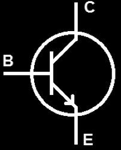
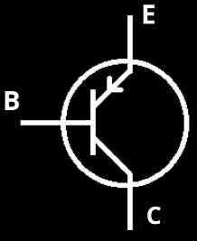
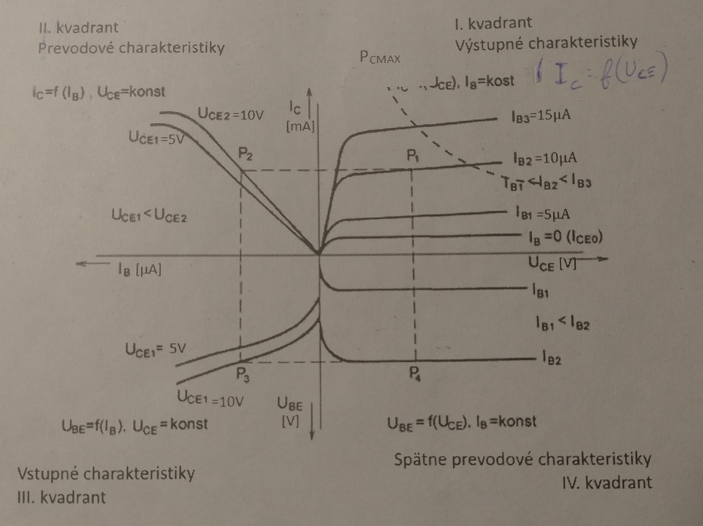

# Zadanie

Bipolárne tranzistory, spôsoby zapojenia bipolárnych tranzistorov, charakteristiky tranzistora v zapojení SE, parametre h (h21e, h21E).

# Vypracovanie

## Bipolárne tranzistory

- Majú zosilňovací efekt
- BIPOLÁRNY = na vedení prúdu sa podieľajú obidva druhy nosičov náboja - elektróny aj diery
- Trojvrstvová polovodičová súčiastka
- Vnútorná vrstva, ktorá má opačný typ nevlastnej vodivosti ako vonkajšie vrstvy, sa nazýva **báza** (B), vonkajšie vrstvy sú **emitor** (E) a **kolektor** (C). Vždy je jedna z týchto elektród spoločná pre vstup aj výstup. (Zapojenia SE, SB a SC).
- Podľa usporiadania vrstiev bipolárne tranzistory delíme na NPN a PNP

NPN

PNP

## Spôsoby zapojenia bipolárnych tranzistorov
Vždy je jedna z týchto elektród spoločná pre vstup aj výstup. Poznáme:
- So spoločnou bázou (SB)
- So spoločným emitorom (SE)
- So spoločným kolektorom (SC)

## Charakteristiky tranzistora v zapojení SE

## Hybridné parametre

- Pri bipolárnych tranzistoroch sa pre popisovanie ich vlastností v praxi najviac používa hybridný model (h model) a vlastnosti tranzistora popisujú h parametre.
- Index označuje:
  - 1 - vstupné hodnoty
  - 2 - výstupné hodnoty
- Pri označovaní parametrov malé písmeno **e** označuje dynamický parameter, veľké **E** znamená statický parameter

- **Dynamické parametre** - určujú sa z *prírastkov* napätí a prúdu $ΔU_{CE}$; $ΔU_{BE}$; $ΔI_{C}$; $ΔI_{B}$ v okolí pracovného bodu
- **Statické parametre** - Určujú sa z *hodnôt* $U$ a $I$ v pracovnom bode, využívajú sa pri výkonových tranzistoroch

### h21e, h21E

- Prúdový zosiľňovací činiteľ - najdôležitejší parameter (2. kvadrant)
- $h_{21e} = \frac{ΔI_{C}}{ΔI_{B}}$; $U_{CE} = konšt.$ (dynamické parametre)
- $h_{21E} = \frac{I_{C}}{I_{B}}$; $U_{CE} = konšt.$ (statické parametre)