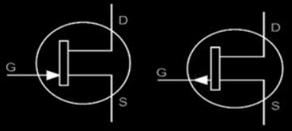
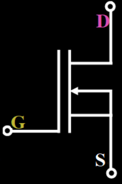

# Zadanie

Unipolárne tranzistory a ich rozdelenie, princíp činnosti jednotlivých typov unipolárnych tranzistorov, príklady použitia unipolárnych tranzistorov.

# Vypracovanie

## Unipolárne tranzistory
- Sú tranzistory riadené elektrickým poľom = napätím (FET - Field Effect Transistor) odkiaľ pochádza aj časť ich názvu
- V unipolárnych tranzistoroch prúd prechádza iba polovodičom jedného typu (N alebo P) a jeho veľkosť sa riadi napätím, narozdiel od bipolárnych, kde prúd prechádza dvomi PN priechodmu a veľkosť sa riadi bázovým prúdom
- Unipolárne sa im hovorí preto, že používajú len jeden typ nosičov - elektróny (kanál typu N), alebo diery  (P).
- Typy unipolárnych tranzistorov:
  - **JFET** - s priechodovým hradlom (Junction Field Effect Transistor)
  - **MOSFET/MISFET** s vodivým kanálom
  - **MOSFET/MISFET** s indukovaným kanálom

## JFET
- Tranzistor ovládaný elektrickým poľom s priechodovým hradlom. Junction = priechod
- Je tvorený základnou doštičkou polovodiča jedného typu
- Z dvoch strán je vytvorená brána G (gate) z polovodiča opačného typu
- Priestorom medzi hradlami preteká prúd, nazýva sa kanál
- G je riadiaca elektróda, ktorá je pripojená k obom poloviciam brány
- Vývody vodivého kanála sú označované:
  - S (source - zdroj - analogicky emitor)
  - D (drain - odtok - analogicky kolektor)

Kanál N (Brána P), Kanál P (Brána N)

## MOSFET/MISFET
- Tranzistory ovládané elektrickým poľom s izolovaným hradlom
- MOSFET - Metal - Oxid - Semiconductor - FET
- MiSFET - Metal - Insulation - Semiconductor - FET

### MOSFET/MISFET s vodivým kanálom
- Základná doštička - polovodič jedného typu
- Do nej sú vytvorené dve elektródy druhého typu polovodiča, sú viac dotované - majú viac prímesí
- Medzi nimi je úzky kanál rovnakého typu s nízkou koncentráciou prímesí
- Na doštičke je nevodivá vrstva (oxid/izolant)
- Na nej je hliníková vodivá elektróda G (kov)

Kanál N (Základ P)

## Príklady použitia unipolárnych tranzistorov
- Používajú sa v obvode riadených spínačov, zosilňovačov, regulátorov napätia, výkonových zosilňovačov atď.
- Napríklad: spínače v počítačoch, adaptéry pre počítače, výkonné LED osvetlenie.