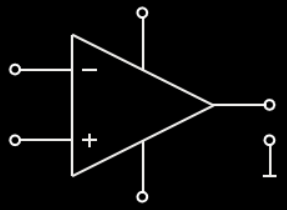
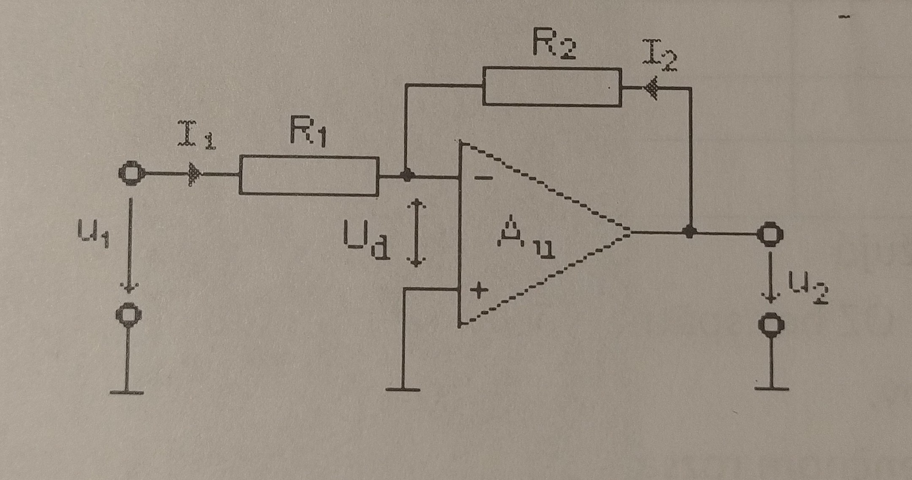
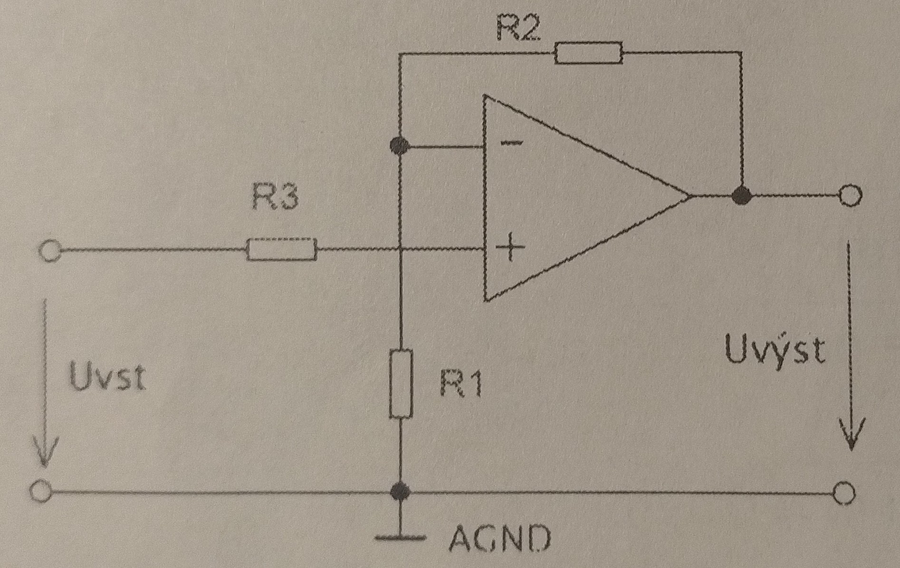

# Zadanie

Operačné zosilňovače a ich základné parametre, rozbor zapojenia invertujúceho a neinvertujúceho zosilňovača s operačným zosilňovačom.

# Vypracovanie

## Operačné zosilňovače

- zosilňovače vyhotovené integrovanou technológiou na jednom kuse kryštálu
- Okrem zosilnenia signálu OZ majú aj iné funkcie - sčítať, odčítať, meniť znamienko, vytvárať rôzne časové priebehy, tvarovať signál
- Patria medzi najrozšírenejšiu skupinu analógových obvodov

## Základné parametre

| Parameter                              | Ideálny OZ | Skutočný OZ     |
| -------------------------------------- | ---------- | --------------- |
| Vstupný odpor $R_{VST}$                | ∞          | 100 kΩ - 1 MΩ   |
| Výstupný odpor $R_{VÝST}$ (impedancia) | 0          | 50 Ω - 150 Ω    |
| Napäťové zosilnenie $A_U$              | ∞          | $10^4$ - $10^7$ |

- $A_U$ je vlastné zosilnenie OZ bez spätnej väzby, na hodnotu požadovanú v danej aplikácii sa $A_U$ upravuje zavedením zápornej spätnej väzby
- u OZ požadujeme, aby ich parametre platili v čo najširšom frekvenčnom rozsahu, aby boli relatívne frekvenčne nezávislé

### Ďalšie parametre

- symetrické/nesymetrické napájanie
- frekvenčný rozsah - pásmo, v ktorom zosilnenie neklesne o 3dB
- rozdielové vstupné napätie - max. rozdiel medzi invertujúcim a neinvertujúcim vstupom
- vstupná prúdová/napäťová nesymetria

## Invertujúci a neinvertujúci zosilňovač

### Invertujúci

- Zosilňuje vstupné napätie, ale obracia fázu výstupného signálu oproti vstupnému o 180°
- $A_U = \frac{U_{výst}}{U_{vst}} = -\frac{R_2}{R_1}$
- $R_1$ - najčastejšie 1 kΩ
- $R_2$ - podľa požadovaného $A_U$
- $R_3$ - rovnaké ako $R_1$, nemá vplyv na zosilnenie

### Neinvertujúci

- Zosilňuje vstupné napätie, ale výstupné napätie má rovnakú fázu ako vstupné
- $A_U = \frac{U_{výst}}{U_{vst}} = \frac{R_2}{R_1} + 1$

### Ďalšie zapojenia OZ

- sumačný (oprava)
- rozdielový (diferenčný)
- komparátor
- komparátor s hysteréziou
- Millerov integrátor
- derivačný zosilňovač
