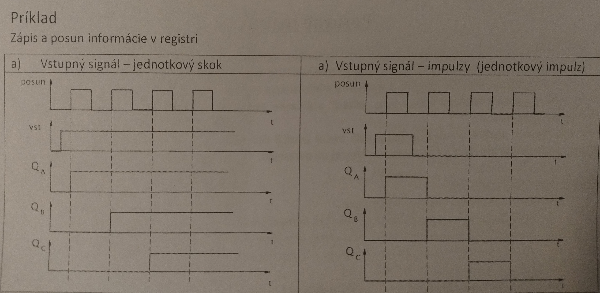

# Zadanie

Typy posuvných registrov a ich realizácia, priebehy výstupných signálov (reakcia na jednotkový skok a impulz), praktické využitie posuvných registrov.

# Vypracovanie

## Posuvné registre

- Sekvenčné logické obvody využívajúce BPO (bistabilné preklápacie obvody)
- Do posuvného registra môžeme vložiť určitú informáciu a túto informáciu môžeme pomocou vonkajších riadiacich postupne posúvať od jedného obvodu k druhému a informácia zostáva uložená v registri (je registrovaná)
- Počet BPO vo vnútri registra udáva jeho "dĺžku" a súčasne počet bitov dvojkovej informácie, ktorá môže byť do registra vložená
- Posuvný register slúži k posúvaniu dát o istý počet pozícií doľava či doprava, alebo v kruhovom registri dáta rotujú, a umožňuje previesť informáciu zo sériovej na paralelnú

## Rozdelenie registrov

- Podľa smeru posúvania informácie
  - jednosmerné - posúva sa jedným smerom
  - obojsmerné - smer posúvania je možné meniť
  - kruhové - informácia obieha registrom dookola
- Podľa spôsobu zápisu informácie
  - registre so sériovým vstupom - informácia sa postupne bit po bite vkladá na vstup 1. BPO
  - registre s paralelnými vstupmi - vkladá sa naraz do všetkých BPO
- Podľa usporiadania výstupov (odber informácie)
  - registre so sériovým výstupom - odoberá sa z posledného BPO bit po bite
  - registre s paralelnými výstupmi - informácia sa z registra odoberá naraz z výstupov všetkých BPO

## Realizácia registrov

- Na ich realizáciu sa používajú JK alebo D BPO
- Ak je použitý D-BPO musí sa použiť variant riadený nábežnou hranou hodinového impulzu (zapisuje aj zapamätáva na nábežnú hranu)

### Priebeh signálov

## Využitie registrov

- Prevod sériovej informácie na paralelnú a naopak
- Automatizačná technika: synchronizácia a riadenie určitých častí zariadenia systému (hlavne kruhový register)