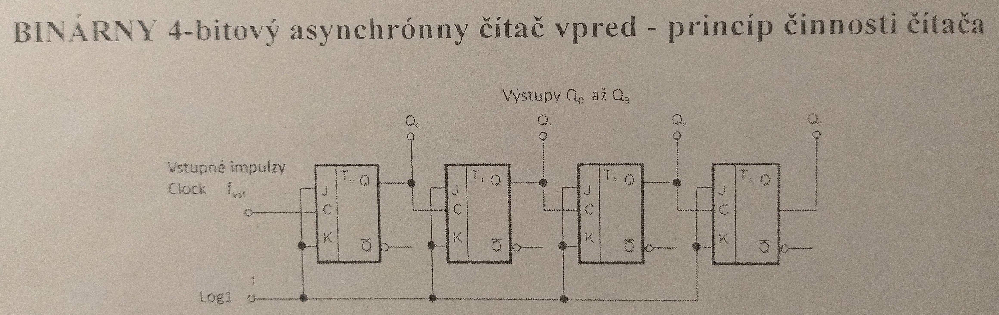
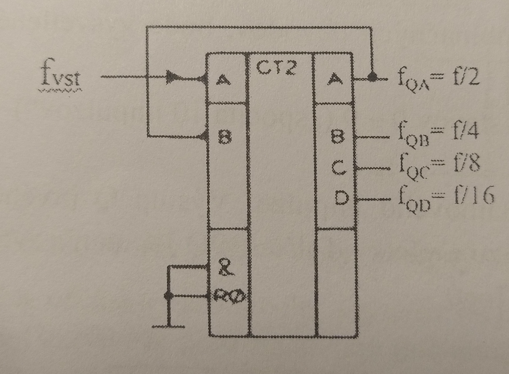
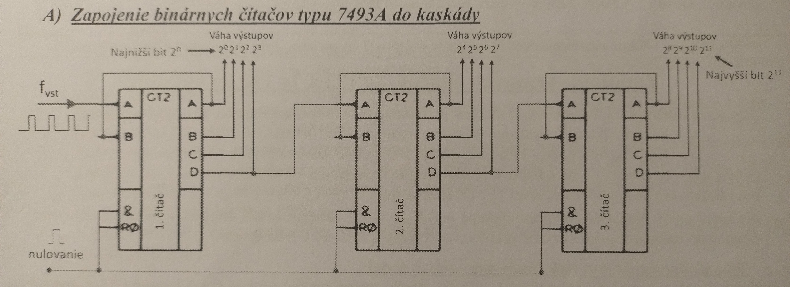

# Zadanie

Logické čítače impulzov, ich rozdelenie, základné zapojenie a zapojenie čítačov do kaskád, základné číslicové kódy a prevodníky kódov.

# Vypracovanie

## Čítače

- sú logické obvody, ktoré v určitom kóde zaznamenávajú počet impulzov privedených na ich vstup
- základ čítačov tvoria JK alebo D-BPO (bistabilný preklápací obvod)
- JK alebo D-BPO sú doplnené kombinačnými logickými členmi, ktoré zabezpečujú koordináciu jednotlivých častí čítača
- BPO môže mať na výstupe 2 hodnoty - log0, po preklopení log1 a naopak. Obvod sa môže preklopiť buď na nábežnú alebo dobežnú hranu
- Kapacita binárneho čítača je $2^n-1$ kde $n$ je počet výstupov čítača
- Pretečenie čítača - dosiahol maximum počítania (koniec cyklu) a po ďalšom impulze sa nastaví do hodnoty 0000

## Rozdelenie čítačov

- Podľa spôsobu spracovania vstupných impulzov
  - **asynchrónne čítače** - vstupné impulzy sú privádzané na vstup 1. BPO, vstup ďalšieho BPO je pripojený na výstup predošlého, sú zapojené do série
  - **synchrónne čítače** - impulzy sú privádzané na vstupy všetkých BPO, sú zapojené paralelne
- Podľa reakcie na hrany impulzu
  - **na nábežnú**
  - **na dobežnú**
- Podľa výstupného kódu
  - **binárne čítače** - výstupný kód je dvojková sústava
  - **desiatkové čítače** - výstupný kód je BCD kód (1248)
  - **Johnsonov čítač** - Johnsonov BCD kód
- Podľa smeru rátania
  - **vpred** - vstupným impulzom sa stav čítača zvyšuje o 1
  - **vzad** - vstupným impulzom sa stav čítača znižuje o 1
  - **vpred/vzad** - podľa vonkajšieho zapojenia ráta vpred alebo vzad, nemôže súčasne aj aj

### Základné zapojenie

Binárny čítač

### Zapojenie do kaskády

## Číslicové kódy

- Číslicový kód je spôsob, akým sú zapisované čisla pomocou znakov - cifry - číslice
- Označenie zápisu čísla v niektorej číselnej sústave sa označí indexom za číslo ($5786_{10}$ alebo $1101_2$)

1. **Desiatková sústava** - používa 10 číslic od 0 po 9, základ sústavy je 10
2. **Binárna sústava** - základ sú mocniny čísla 2(váhy kódu), jednotlivé váhy kódu sú bity
3. **BCD kód** - zobrazenie desiatkového čísla v binárnom kóde, každej číslici sú priradené 4 bity
4. **Šestnastková sústava** - 16 symbolov 0-9, A, B, C, D, E, F, za hex. číslom sa píše index H (2D5H)
5. **Kód 1 z n** - Kód má n bitov, vždy iba 1 bit má hodnotu 1, ostatné 0

### Prevodníky kódov

- Logické kombinačné obvody, ktoré prevádzajú informáciu z jednej kódovanej formy do inej
- Majú paralelné vstupy pre pôvodný kód a paralelné výstupy pre nový kód
- Počet vstupov a výstupov zodpovedá počtu bitov jednotlivých kódov
- Podľa druhu prevodu delíme na:
  - z dvojkovej do BCD a naopak
  - z dvojkovej/BCD na *1 z n* a naopak
  - z dvojkovej/BCD na kód 7 segmentovej zobrazovacej jednotky