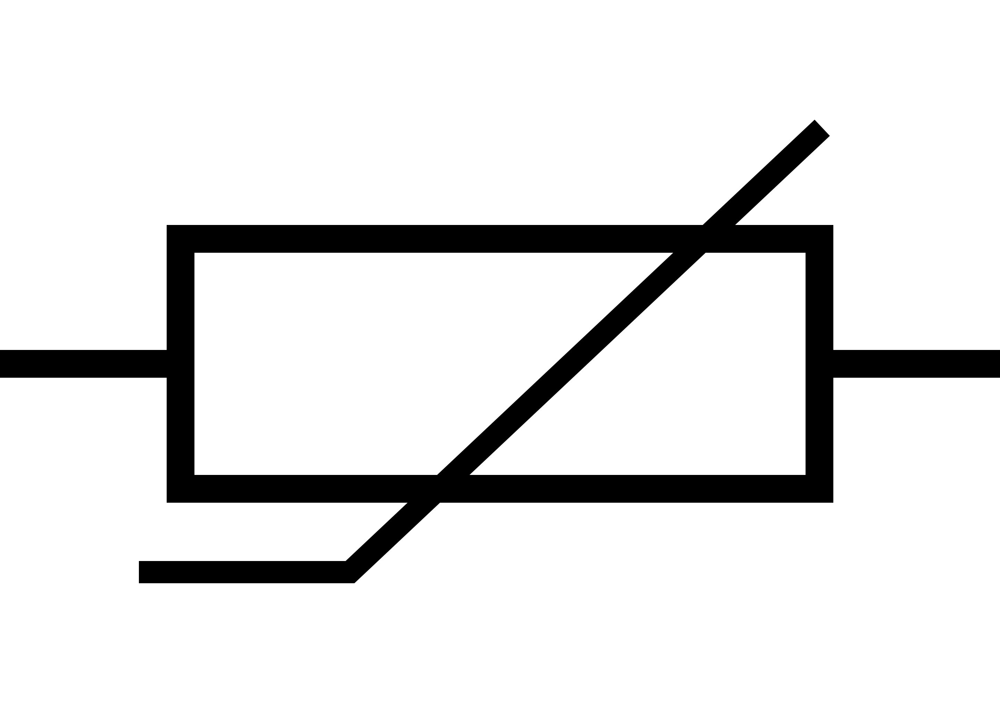
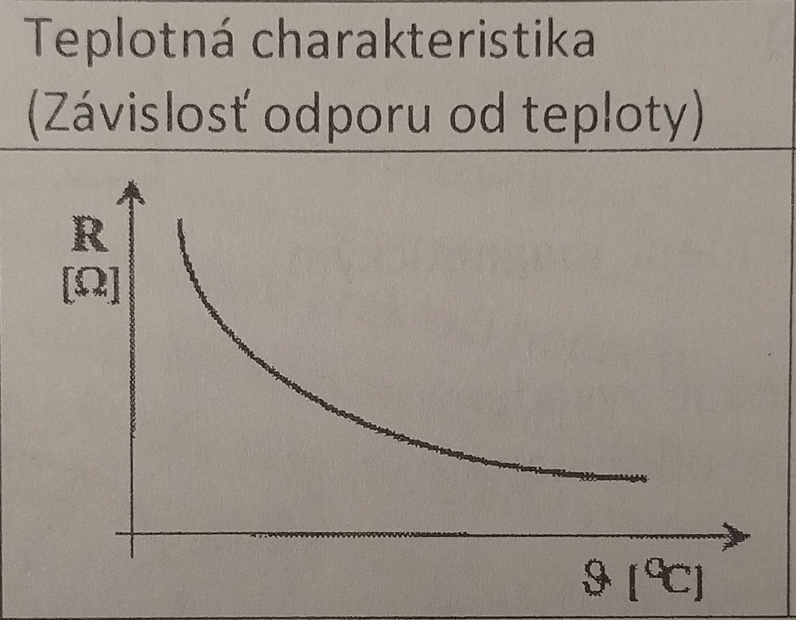
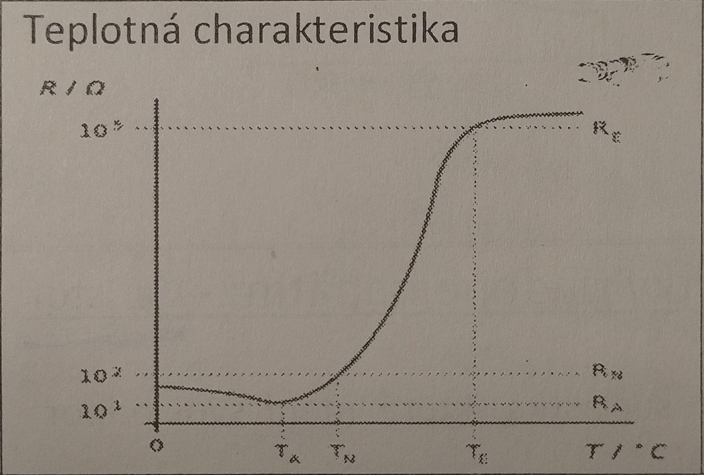
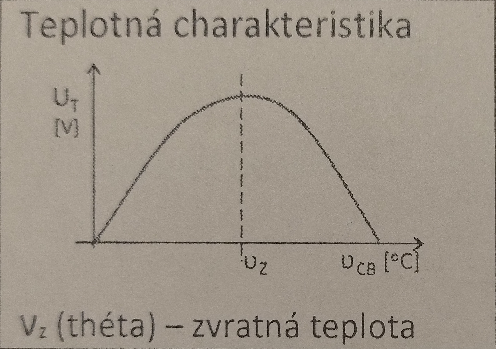

# Zadanie

Súčiastky riadené teplom, ich vlastnosti, parametre a VA-charakteristiky, vlastnosti jednotlivých súčiastok – ich využitie.

# Vypracovanie

## Termistor

- Polovodičová súčiastka bez PN priechodu, jej elektrický odpor je závislý od teploty
- Podľa teplotnej závislosti sa delia na dva druhy:
  - NTC termistor - negastor - **jeho odpor pri zahrievaní klesá** (Negative Temperature Coefficient)
  - PTC termistor - pozistor - **jeho odpor pri zahrievaní rastie** (Positive Temperature Coefficient)

- **Dôležité parametre termistorov**
  - Menovitý odpor
  - Maximálna zaťažitelnosť - najvyššia hodnota elektrického príkonu
  - Teplotná časová konštanta - čas, za ktorý sa zmení teplota termistora vplyvom výmeny tepla s okolím o 63,2%
  - Maximálna prevádzková teplota

### Negastor

- **Výhody**
  - malé rozmery a hmotnosť
  - veľká teplotná citlivosť
  - veľká zmena odporu pri malej zmene teploty
- **Nevýhody**

  - veľký rozptyl parametrov pri rovnakých typoch termistorov

- **Použitie**
  - Meranie teploty (od -200°C po 1000°C)
  - Obmedzovanie prúdových nárazov
  - Oneskorené zapínanie (čas, kým sa termistor zahreje)

### Pozistor

- **Použitie**
  - Snímače teploty
  - Oneskorené vypínanie

## Termočlánok

- Vznikne spojením dvoch rôznych kovov, ktoré sú na jednom konci spojené a na druhom voľné
- Princíp činnosti je založený an termoelektrickom jave: ak sa zohrieva spoj dvoch rôznych kovov, objaví sa na svorkách jednosmerné napätie - termoelektrické napätie a jeho veľkosť závisí od teploty spoja
- Dvojice kovov - platina-konštantán, chromel-konštantán, platina-zinok, zinok-konštantán
- **Použitie**
  - Snímače teploty
  - Meranie neharmonických a VF prúdov
  - Používajú sa len po $v_z$ (zvratnú teplotu), pri použití nad túto teplotu by vznikla nejednoznačnosť - jednej hodnote napätia $U_T$ by zodpovedali dve hodnoty teploty

