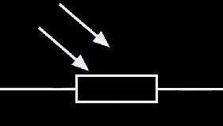
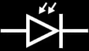
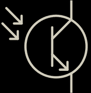

# Zadanie

Súčiastky riadené svetlom, ich vlastnosti a VA-charakteristiky, princíp činnosti optoelektrických spojovacích prvkov.

# Vypracovanie

- Tieto súčiastky využívajú vnútorný fotoelektrický jav:
  - Pri dopade svetelnej energie na monokryštál polovodiča sa uvoľňujú z kovalentných väzieb v kryštálovej mriežke elektróny a zvýšujú tak elektrickú vodivosť polovodiča
  - poznáme: **fotorezistor, fotodiódu, fototranzistor, fototyristor, optický člen**

## Fotorezistor

- polovodičová súčiastka, ktorej veľkosť odporu závisí na intenzite osvetlenia E
- Pracuje na princípe vnútorného fotoelektrického javu
- **Vlastnosti**:

  - Veľmi vysoký odpor ($10^6 - 10^9$Ω) a po osvetlení sa zmenší
  - Závislosť odporu R od osvetlenia je približne logaritmická
  - Má veľkú zotrvačnosť, rýchlosť zmeny odporu závisí od intenzity osvetlenia E (väčšia intenzita = reaguje rýchlejšie)
  - Veľká teplotná závislosť, nárastom teploty odpor klesá
  - Pomalá odozva na zmenu intenzity (nepoužiteľný na prenos dát)

- **Použitie**:
  - Meranie osvetlenia
  - Meranie a regulácia v závislosti od intenzity osvetlenia (expozimetre kamier a fotoaparátov, súmrakové spínače osvetlenia, regulátory jasu displejov...)

## Fotodióda

- 2-vrstvová súčiastka
- Je konštrukčne upravená tak, aby do oblasti PN priechodu prenikalo svetlo
- Bez osvetlenia sa správa ako normálna dióda
- V-A charakteristika je v 3 kvadrantoch
  - **I. Kvadrant** - normálna polovodičová dióda
  - **III. Kvadrant** - odporový režim - dióda je v závernom smere, správa sa ako pasívna súčiastka, odpor závisí od intenzity osvetlenia **E**
  - **IV. Kvadrant** - fotovoltaický režim - správa sa ako zdroj energie
- **Použitie**:
  - Meracie a komunikačné účely
  - Meranie osvetlenia
  - Prijímač v optických spojoch
  - snímanie optického záznamu signálu

## Fototranzistor

- Konštrukciou zhodný s bipolárnym tranzistorom
- 2 vývody - C a E (báza nie je vyvedená)
- namiesto prúdu do B sa na riadenie využíva svetelná energia
- využíva vnútorný fotoelektrický jav
- svetlo preniká na priechod BE
- citlivosť je väčšia ako u fotodiódy, rýchlosť a šumové parametre sú horšie
- **Použitie**:
  - Rovnaké ako u fotodiódy
  - Najviac v optočlenoch

## Optočlen (optrón - optický spojovací člen)
- Spojenie dvoch polovodičových súčiastok do jedného puzdra
- Skladá sa z riadeného zdroja svetla ZS a fotoelektrického prijímača FP
- ZS a FP musia mať rovnaké spektrálne charakteristiky
  - ZS - LED dióda, doba spínania: $t_r=10^7 / 10^8s$
  - FP - fotodióda, fototranzistor
- Podľa napätia sa delia pre jednosmerné alebo striedavé napätie
- Keď privedieme na vstup optočlena malý prúd potrebný na rozsvietenie LED, fototranzistor sa začne otvárať podľa veľkosti prúdu prechádzajúceho diódou (väčší prúd -> viac svetla -> viac sa otvorí tranzistor)
- **Použitie**:
  - Slúži ku galvanickému oddeleniu dvoch obvodov, obvody sú prepojené v tomto prípade svetlom (galvanický spoj = vodivý spoj)