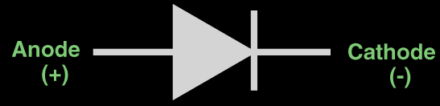

# Zadanie

Vlastná a nevlastná vodivosť polovodičov, princíp P-N priechodu, diódy pre všeobecné použitie, VA-charakteristika, parametre, druhy polovodičových diód, ich parametre a využitie.

# Vypracovanie

## Vlastná vodivosť

- Ak z vonku dodáme do materiálu také množstvo energie, ktoré dovolí elektrónom prekonať zakázané pásmo, rozbijú sa niektoré väzby
- Elektróny uvoľnené z týchto väzieb sa voľne pohybujú v kryštálovej mriežke a vedú elektrický prúd
- Vo väzbe, z ktorej sa uvoľnil elektrón zostáva voľné miesto nazývané **diera**
- Diera pôsobí na okolité náboje rovnako, ako keby tam je kladný náboj s rovnakou hodnotou, akú má náboj elektrónu
- Zaplnenie diery vo väzbe vznikne pritiahnutím niektorého voľného elektrónu - REKOMNBINÁCIA

## Nevlastná vodivosť

### Typu N

- D - donor - označenie atómu prímesi
- V kryštálovej mriežke 4-mocného prvku nahradíme niektoré jeho atómy atómami 5-mocného prvku
- Na vytvorenie kovalentnej väzby v kryštálovej mriežke sa zúčastnia iba 4 valenčné elektróny donora
- 5\. elektrón, ktorý sa nezúčastňuje väzby je voľne viazaný k donorovi
- Polovodiče, ktoré obsahujú 5-mocné prímest sa nazývajú **polovodiče typu N**

### Typu P

- A - akceptor - označenie atómu prímesi
- V kryštálovej mriežke 4-mocného prvku nahradíme niektoré jeho atómy atómami 3-mocného prvku
- Na vytvorenie kovalentnej väzby v kryštálovej mriežke so susednými atómami chýba jeden elektrón
- Voľné miest ovo väzbe výtvorí dieru, ktorá má kladný náboj
- Na vytvorenie prúdu sa využíva zdanlivý pohyb kladných nábojov = dier
- Polovodiče, ktoré obsahujú 3-mocné prímest sa nazývajú **polovodiče typu P**

## PN priechod

- Miesto na polovodiči, kde sa vodivosť P mení na vodivosť N
- Po spojení polovodiča P a N začne pôsobiť **difúzia**, to značí, že voľné nosiče náboja sa snažia rovnomerne rozptýliť v celom objeme monokryštálu polovodiča - elektróny prechádzajú z N do P a diery z P do N
- v N začína prevládať kladný náboj a v P záporný. Medzi P a N sa vytvára rozdiel potenciálov - **Difúzne napätie** $U_D$
- Z okolia PN priechodu (1μm) sú vytlačené všetky majoritné nosiče náboja - **vyprázdnená oblasť** (potenciálová bariéra)

## Dióda

- dvojvrstvová súčiastka, pri svojej činnosti využíva PN priechod

$U_{AK}$ - napätie medzi anódou a katódou

### Priepustný smer

- anóda je na + a katóda na -
- má nízke **prahové** napätie, po jeho prekročení prúd prudko stúpa (odpor klesá, PN priechod sa otvára)

### Záverný smer

- anóda je na - a katóda na +
- má vysoké **prierazné** napätie, po jeho prekročení sa dióda prerazí (PN priechod zanikne)

## Druhy diód

- **Usmerňovacie** - v porovnaní s všeobecnými majú vyššie maximálne hodnoty (väčšia dovolená anódová strata) - sú určené na vyššie prúdy
- **Zenerove (stabilizačné)** - záverný smer, využívajú lavínový jav: prudký nárast prúdu v závernom smere
- **Kapacitné** - záverný smer, elektronicky riadená kapacita
- **Spínacie** - využívajú Shottkyho kontakt - spojenie kov-polovodič, krátka doba zotavenia
- **PIN dióda** - medzi P a N je vložený vlastný (intrinzický) polovodič
- **Fotodióda** - čím väčšia intenzita svetla, tým viac prúdu prechádza
- **LED** - čím väčší prúd, tým viac svieti