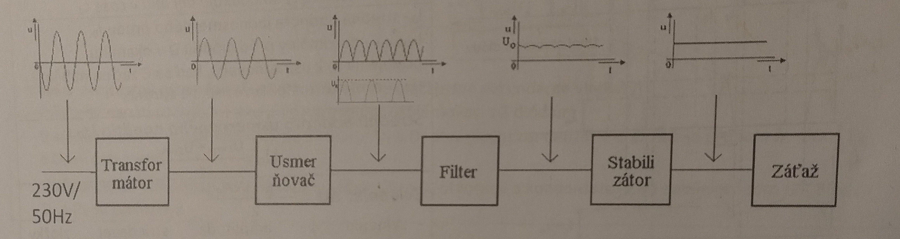

# Zadanie

Sieťové napájacie zdroje a ich využitie, bloková schéma sieťového napájacieho zdroja, činnosť a funkcia jednotlivých blokov v sieťovom napájacom zdroji.

# Vypracovanie

## Napájací zdroj

- Elektronický obvod, ktorého úlohou je zabezpečiť elektrickú energiu požadovaných parametrov pre napájaný obvod, obvykle premenou elektrickej energie z iného zdroja
- Zdroje, ktoré čerpajú energiu z bežnej elektrickej siete nazývame **sieťové**
- Ich vstupom je striedavé napätie s $f = 50 - 60\ Hz$ v rozsahu $110 - 230\ V$
- Konštruujú sa buď s bežným transformátorom, usmerňovačom a lineárnym stabilizátor, alebo ako spínacie, ich výstupom je jednosmerné napätie
- Tiež sa označujú ako **lineárne** - sieťové napätie sa dodáva priamo do transformátora

### Rozdelenie

- Podľa výstupnej veličiny
  - **Napäťové** - čo najmenší vnútorný odpor
  - **Prúdové** - čo najväčší vnútorný odpor
- Podľa stability výstupnej veličiny (spôsob stabilizácie výstupnej veličiny)
  - **Nestabilizované** - pred záťažou je zapojený len filter
  - **Stabilizované** - pred záťažou na výstupe je zapojený stabilizátor, ktorý môže byť:
    - parametrický (so zenerovou diódou)
    - spätnoväzbový

### Bloková schéma

- **Transformátor** - mení amplitúdu vstupného signálu/napätia na požadovanú hodnotu, nemení jeho frekvenciu
- **Usmerňovač** - usmerňuje striedavý prúd
- **Filter** - vyhlazuje striedavý signál z usmerňovača = zmenší zvlnenie (striedavá zložka jednosmerného signálu)
- **Stabilizátor** - stabilizuje jednosmernú zložku $U_O$ resp. $I_O$ a zmenšuje zvlnenie

## Spínané zdroje

- **Výhody**:
  - Ľahší a menší transformátor
  - Účinnosť medzi 85-95%
- **Nevýhody**
  - Zložitejšie zapojenie -> vyššia cena
  - Spínací princíp môže byť zdrojom rušenia šíriaceho sa v sieti, je potrebné ho potlačiť