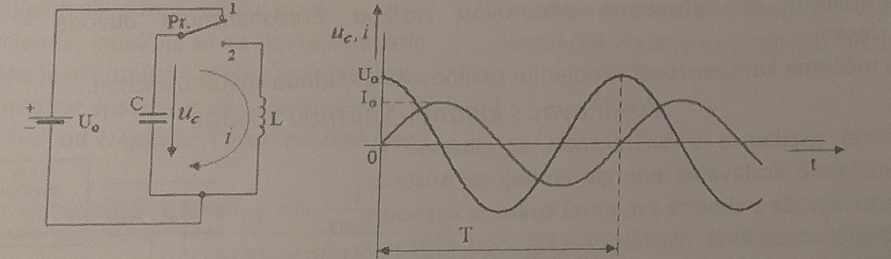
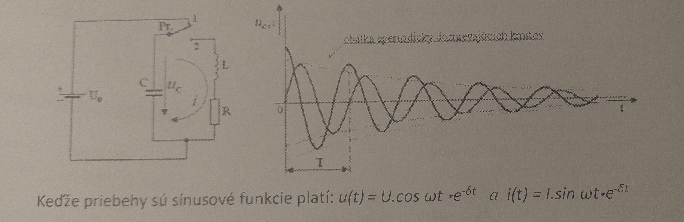

### nevim ani jak mam z tohoto poznamky robit iba treba dufat ze si to nevytahneme

# Zadanie

Princíp vzniku harmonických kmitov, ideálny a skutočný rezonančný obvod, všeobecná, amplitúdová a fázová podmienka vzniku kmitov, popíšte podľa obrázkov jednotlivé zapojenia oscilátorov

# Vypracovanie

## Vznik harmonických kmitov

### Ideálny rezonančný LC obvod

- Ak je prepínač prepnutý do polohy 1 kondenzátor C je pripojený ku zdroju napätia $U_O$. Z tohto zdroja sa kondenzátor tiež nabije na $u_C = U_O$
- Po prepnutí prepínača do polohy 2 sa ku kondenzátoru C pripojí cievka L, cez ktorú sa kondenzátor začne vybíjať a obvodom začne tiecť prúd $i$. Ten vytvára v okolí cievky magnetické pole

### Skutočný rezonančný obvod

- V praxi ideálne prvky neexistujú a kondenzátor a cievka majú určité stratové odpory. Pretože stratový odpor cievky je omnoho väčší ako u kondenzátora, pri sledovaní vlastností reálneho rezonančného obvodu RLC stratový odpor kondenzátora zanedbáme
- Stratový rezostor $R$ je zapojený v sérii s cievkou $L$
- Amplitúda vzniknutých kmitov postupne klesá, až úplne zaniknú

## Podmienky vzniku kmitov

- Aby generátor vyrábal kmity s konštantnou amplitúdou musí byť do obvodu dodávaná energia, ktorá bude kompenzovať straty na odpore $R$ rezonančného odporu
- Energia musí byť do rezonančného obvodu dodávaná v správnom množstve v správnom momente
- **Amplitúdová** - určuje množstvo dodávanej energie
- **Fázová** - určuje okamih dodávania energie