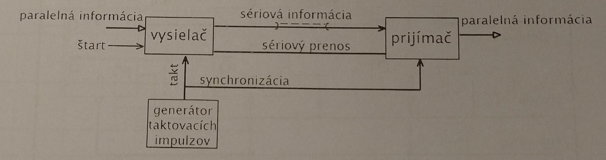
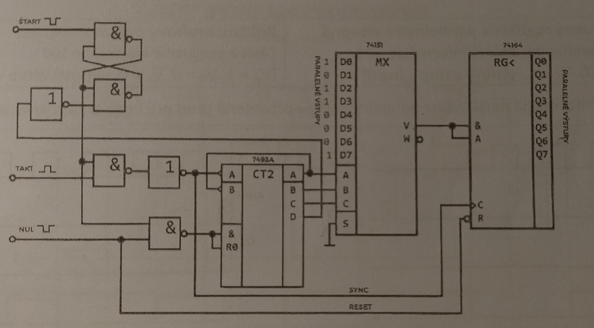
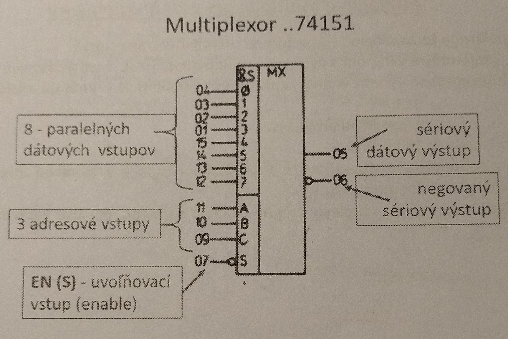
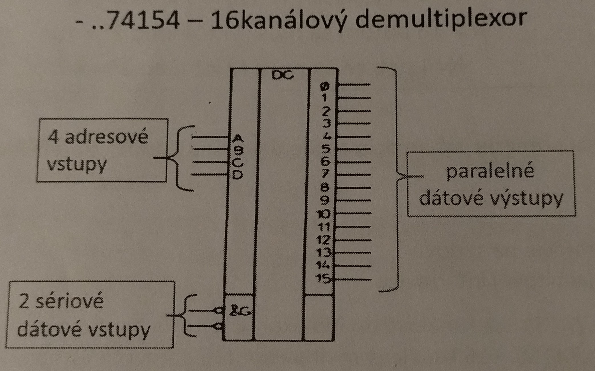

# Zadanie

Bloková schéma sériového prenosu informácií, funkcie jednotlivých častí v blokovej schémy, multiplexory, demultiplexory, značky, využitie.

# Vypracovanie

## Sériový prenos informácie

- Prenos informácie bit po bite => ušetria sa tým prenosové cesty
- Nevýhodou je dlhší čas potrebný na prenos

### Realizácia sériového prenosu informácií

- **Vysielač** môže byť multiplexor (pre dlhšiu informáciu) alebo posuvný register
- Na dátové vstupy multiplexora privedieme paralelnú informáciu, čítačom je adresovaný 1. dátový vstup (Do)
- Informácia z tohto vstupu sa privedie na výstup multiplexora, tým aj na sériovú prenosovú linku aj na vstup prijímača
- Štartovacím impulzom zmeníme stav výstupu Q RS BPO z log0 na log1, tým sa prestane čítač nulovať a taktovacie impulzy sa dostávajú na vstup čítača a na synchronizačnú linku
- Nábežnou hranou taktovacích impulzov sa info zo sériovej linky zaznamená do prijímača
- Dobežnou hranou taktovacieho impulzu sa zvýši stav čítača o jedna. Tým sa adresuje ďalší vstup a dátový vstup. Info z tohto vstupu sa cez multiplexor dostáva na sériovú linku
- Príchodom 8. taktovacieho impulzi sa na nábežnú hranu posledný bit paralelnej informácie zapíše do prijímača a na dobežnú hranu sa stav čítača zvýši na 1 0 0 0 (D C B A)
- Logickou 1 z výstupu D čítača sa preklopí RS BPO - na jeho výstupe Q je log0, tým sa zablokuje prívod taktovacích impulzov na vstup čítača a prenos sa zastaví, čítač sa vynuluje

## Multiplexory

- Logický kombinačný obvod, ktorý funguje na princípe elektronického prepínača, ktorý postupne prepína n vstupných signálov na jeden výstup
- Príslušný vstup sa vyberá adresovým signálom
- Má:
  - **N** dátových vstupov
  - **M** adresových výstupov
  - **EN (S)** - uvoľňovací vstup (enable) slúži na adresáciu celého multiplexora, aby multiplexor pracoval, musí byť aktivovaný úrovňou log0
- Počet adresových vstupov **M** musí byť taký, aby každý z dátových vstupov sa dal jednoznačne adresovať => každý dátový vstup musí mať svoju adresu
- \*\*Ak je počet dátových vstupov N, musí platiť $N \le 2^M$

  - N=8 => M=3
  - N=16 => M=4
  - N=4 => M=2

- **Princíp**: na výstup Y multiplexora sa prenesie informácia z toho dátového vstupu, ktorého adresa je privedená na adresové vstupy
- **Využitie**:
  - prevod paralelnej informácie na sériovú
  - výber určitého bitu z viacbitovej informácie

## Demultiplexor

- Logický kombinačný obvod, ktorý prepína jeden vstupný signál na niekoľko výstupov, príslušný výstup sa vyberá adresovaným signálom
- Obvod má:

  - **G** - 1 dátový vstup
  - **N** výstupov
  - **M** adresových vstupov, ktorými sa adresujú výstupy, zase platí $N \le 2^M$

- **Princíp**: informácia z dátového vstupu sa prenesie na ten výstup N, ktorého adresa je privedená na adresové vstupy M
- **Využitie**:
  - prevod sériovej informácie na paralelnú
  - prevodník binárneho kódu na kód 1 z n

