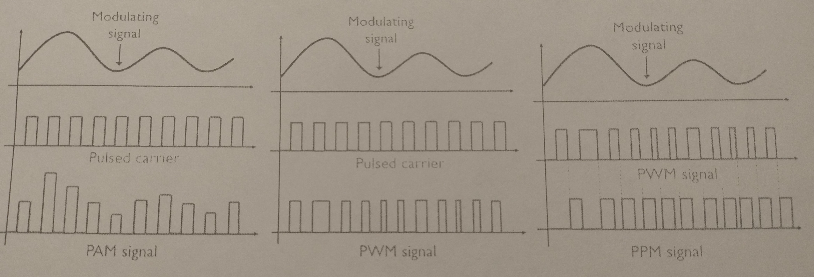

# Zadanie

(text 3.12)Rozdelenie a základné pojmy modulácií, jednotlivé druhy modulácií (AM, FM, PWM...), využitie modulácií v praxi.

# Vypracovanie

## Modulácia

- **Proces, pri ktorom dochádza ku zmene niektorého parametra nosnej vlny podľa zmien modulačného signálu (tvarovanie nosnej vlny podľa modulačného signálu)**
- Pri bezdrôtovom prenose správ na veľké vzdialenosti sa využíva prenos pomocou elektromagnetického poľa
- Ak chceme preniesť určitú konkrétnu informáciu (hlas, hudba, obraz..) musíme túto informáciu preniesť na elektrický signál
- Elektromagnetické pole, ktoré by vzniklo pôsobením tohto signálu na anténe, väčšinou nemá charakter elektromagnetickej vlny - nie je schopný sa šíriť prostredím - je to NF signál
- Preto musíme el. signál, ktorý obsahuje prenášanú informáciu spojiť s elektrickým signálom, ktorý po vyžiarení bude mať charakter elektromagnetickej vlny - tomuto hovoríme **modulácia**
- Každý striedavý signál má tri základné parametre, ktoré ho charakterizujú - **amplitúda, frekvencia a fáza**

### Pojmy

- **Modulačný signál** - (NF) - vyjadruje pôvodnú informáciu, môže byť analógový alebo impulzový
- **Nosný signál** - harmonický signál (VF), môže byť **spojitý** - hovoríme o spojitých / analógových moduláciách, alebo **impulzový** (taktovací signál) - hovoríme o nespojitých / impulzových moduláciách
- **Modulovaný signál** - výsledný signál modulácie, tvarovaný signál - (VF)

## Spojité - analógové modulácie

- **Amplitúdová modulácia AM** - pôvodná konštantná amplitúda nosnej vlny sa mení vplyvom amplitúdy modulačného signálu.(frekvencia a fáza sa nemení)
- **Frekvenčná modulácia FM** - mení sa frekvencia nosnej vlny v závislosti od amplitúdy modulačného signálu, amplitúda nosnej vlny sa nemení
- **Fázová modulácia FzM / PM** - v závislosti od amplitúdy modulačného signálu sa mení fáza (fázový posun) nosnej vlny (amplitúda a frekvencia sa nemení)

Medzi FM a FzM existuje vzájomný vzťah - FM vytvára FzM a naopak

### AM

- Amplitúda výslednej modulovanej vlny $U$ je v každom okamihu daná súčtom alebo rozdielom amplitúdy nosnej vlny $U_n$ a okamžitej hodnoty modulačného signálu $u_m$
- **Použitie**: dlhé, stredné, krátke vlny - pri rozhlasovom vysielaní je šírka pásma 9kHz, prenos obrazu pri analógovom prenose TV signálu

### FM

- Pri FM sa mení frekvencia nosnej vlny podľa frekvencie modulačného signálu, amplitúda modulovanej vlny ostáva konštantná
- **Porovnanie s AM**: jednoduchší modulátor a vysielač, modulácia sa môže robiť priamo v oscilátore nosného signálu
- **Použitie**: rozhlasové vysielanie (VKV), pre prenos zvukového signálu pri pozemnom TV vysielaní, prenos obrazu a zvuku pri satelitnom vysielaní

### FzM

- Pri FzM sa mení fáza modulovanej nosnej vlny v rytme zmien modulačného signálu, amplitúda modulovanej nosnej vlny ostáva konštantná

## Impulzové modulácie (nespojité)

- Pri impulzových moduláciách je nosným signálom impulzový signál (signál pravouhlých impulzov)
- Sú to diskrétne modulácie, pretože výsledný signál je nespojitý
- Modulačným signálom môžeme meniť výšku impulzu (amplitúdu), šírku alebo polohu (fázu) impulzu
- Podľa toho rozdeľujeme impulzové modulácie na:
  - **Amplitúdová impulzová modulácia PAM**
  - **Šírková impulzová modulácia PWM**
  - **Polohová impulzová modulácia PPM**

