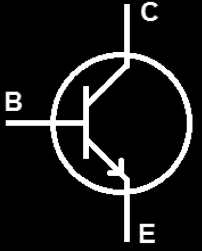
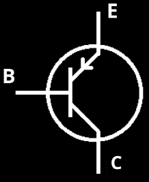
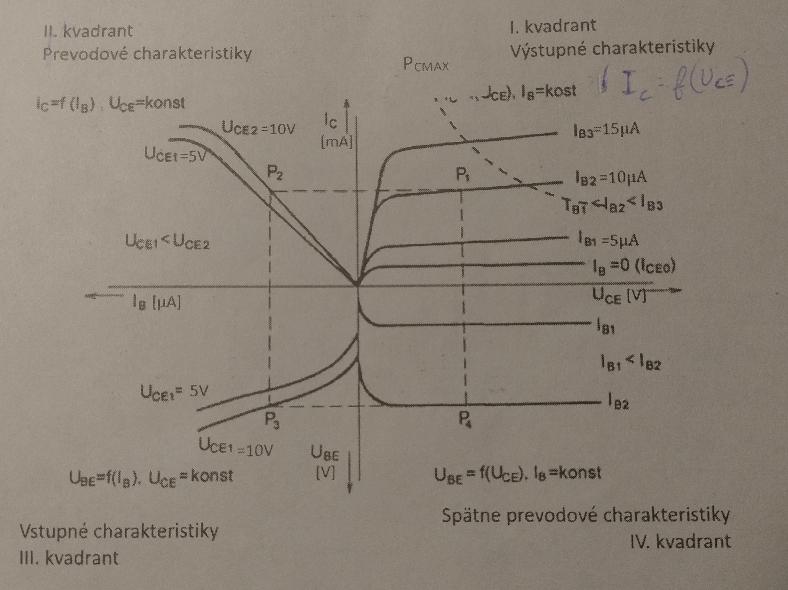

# Zadanie

Bipolárne tranzistory, spôsoby zapojenia bipolárnych tranzistorov, charakteristiky tranzistora v zapojení SE, parametre h (h21e, h21E).

# Vypracovanie

## Bipolárne tranzistory

- Majú zosilňovací efekt
- BIPOLÁRNY = na vedení prúdu sa podieľajú obidva druhy nosičov náboja - elektróny aj diery
- Trojvrstvová polovodičová súčiastka
- Vnútorná vrstva, ktorá má opačný typ nevlastnej vodivosti ako vonkajšie vrstvy, sa nazýva **báza** (B), vonkajšie vrstvy sú **emitor** (E) a **kolektor** (C). Vždy je jedna z týchto elektród spoločná pre vstup aj výstup. (Zapojenia SE, SB a SC).
- Podľa usporiadania vrstiev bipolárne tranzistory delíme na NPN a PNP

NPN

PNP

## Spôsoby zapojenia bipolárnych tranzistorov
Vždy je jedna z týchto elektród spoločná pre vstup aj výstup. Poznáme:
- So spoločnou bázou (SB)
- So spoločným emitorom (SE)
- So spoločným kolektorom (SC)

## Charakteristiky tranzistora v zapojení SE

