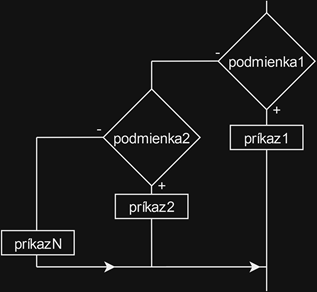

# Zadanie

Pojem relačný operátor a na čo slúži, jednotlivé relačné operátory a ich priorita, vetvenie if/else if, jeho vývojový diagram a zápis v jazyku C++, vetvenie switch a jeho zápis v jazyku C++.

# Vypracovanie

## Relačné operátory

- Slúžia k porovnaniu 2 hodnôt. Výsledkom porovnania je buď true, alebo false.

| Operátor | Význam                |
| -------- | --------------------- |
| >        | Väčší ako             |
| <        | Menší ako             |
| >=       | Väčší alebo rovný ako |
| <=       | Menší alebo rovný ako |
| ==       | Rovný                 |
| !=       | Nerovný               |

## Vetvenie

Vetvenie je základný prostriedok, ktorý umožňuje riadiť beh programu. Podľa hodnoty premenných prebieha výpočet rôznymi cestami – vetvami.

### Viacnásobné vetvenie - if / else if / else

```cpp
if (podmienka1)
  prikaz1;
else if (podmienka2)
  prikaz2;
…
else
  prikazN;
```

- Pri viacnásobnom vetvení sa ďalšia podmienka pridáva do zápornej vetvy. Ak je prvá podmienka splnená, vykoná sa prvý príkaz. Pokiaľ prvá podmienka nie je splnená a zároveň je pravdivá druhá podmienka, vykoná sa druhý príkaz, atď.



### Príkaz switch (prepínač)

```cpp
switch (vyraz) { // výraz nadobúda konkrétne hodnoty (nie je to boolovský výraz)
	case hodnota1:
		prikaz1;
		break; // break ukončí vetvu a celý prepínač
	case hodnota2:
		prikaz2;
		break; 
	case hodnotan:
		prikazn;
		break;
	default:
		prikaz;
}
```

- Príkaz switch je podobný príkazu if s niekoľkými vetvami. Porovná hodnotu výrazu (môže byť typu int, char alebo enum) s hodnotami nachádzajúcimi sa za kľúčovým slovom case. Pokiaľ sa výraz rovná jednej z hodnôt, vykoná sa príslušný príkaz.

- Forma zápisu:
  - Za kľúčové slovo switch sa do zátvoriek zapíše výraz, potom nasleduje blok, do ktorého sa uvedú všetky vetvy.
  - Vetva sa začína kľúčovým slovom case (prípad),nasleduje porovnávaná hodnota , dvojbodka a príkaz.
  - Každá vetva musí byť ukončená príkazom break (zlomiť), ktorý ukončí vetvu a celý prepínač.
  - Vetva default (východzia) je nepovinná. Táto vetva sa realizuje v prípade, ak výraz nebol rovný žiadnej z porovnávaných hodnôt.
