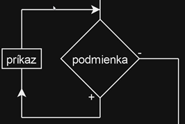

# Zadanie

Pojem cyklus, typy cyklov, vývojový diagram a zápis v C++ pre cyklus while, príkazy break a continue.
Príklad: Napíšte pomocou cyklu while nasledovný program: Zadajte z klávesnice číslo. Pokiaľ je číslo väčšie ako 10, číslo vydeľte 2. Na záver vypíšte hodnotu koncového čísla.

# Vypracovanie

## Cyklus

Cyklus je štruktúra, ktorá opakuje zadaný kus kódu, pokiaľ je splnená nejaká podmienka. Každému opakovaniu cyklu sa hovorí iterácia.

V C++ poznáme 3 typy cyklov:

1. cyklus s podmienkou na začiatku - while
2. cyklus s podmienkou na konci - do while
3. cyklus s určeným počtom opakovaní – for

### Cyklus while

- cyklus s neznámym počtom opakovaní (môže sa použiť aj pri známom počte opakovaní)
- príkaz sa nemusí vykonať ani raz

```cpp
while (podmienka) // bez ;
  prikaz;
```

- Cyklus s podmienkou na začiatku testuje podmienku vykonávania vždy pred vstupom do tela cyklu a riadi sa týmito pravidlami:
  - ak je podmienka pravdivá (true), príkaz sa vykoná
  - ak je podmienka nepravdivá (false), cyklus sa ukončí
  - pokiaľ je podmienka nepravdivá pred prvým vykonaním cyklu, príkaz sa nevykoná ani raz.



### Break – predčasné ukončenie cyklu

- Príkaz break slúži k predčasnému ukončeniu cyklu. Vykonaním tohto príkazu je cyklus v danom mieste okamžite ukončený.

### Continue - vynechanie jedného kroku cyklu

- Príkaz continue (pokračuj) slúži pre predčasné ukončenie jedného kroku (iterácie) cyklu. Príkazy vložené do tela cyklu za príkaz continue sa už nevykonajú, cyklus ale nekončí a vracia sa na test podmienky vykonávania tela cyklu.
- Príkaz continue sa používa v tele cyklu väčšinou v spojení s podmienkou.

# Príklad

Napíšte pomocou cyklu while nasledovný program: Zadajte z klávesnice číslo. Pokiaľ je číslo väčšie ako 10, číslo vydeľte 2. Na záver vypíšte hodnotu koncového čísla.

```cpp
#include <iostream>
using namespace std;

int main() {
	int cislo;

	cout << "Zadajte cislo: ";
	cin >> cislo;

	while (cislo > 10) {
		cislo /= 2;
	}

	cout << "Koncove cislo: " << cislo << endl;

	return 0;
}
```
