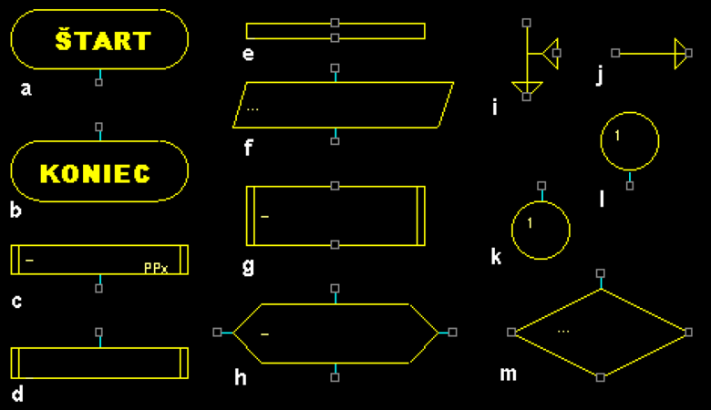

# Zadanie

Pojem algoritmus, podmienky, ktoré musí spĺňať algoritmus, možnosti zápisu algoritmov, základné značky vývojových diagramov (VD).
Príklad: Nakreslite VD algoritmu, ktorý porovná dve čísla zo vstupu a vypíše väčšie z nich.

# Vypracovanie

## Algoritmus

Algoritmus je konečná postupnosť dobre definovaných inštrukcií na splnenie určitej úlohy. Môžu byť zapísané (implementované) vo forme počítačových programov. Logická chyba v algoritme môže viesť k zlyhaniu výsledného programu. Pojem algoritmu sa často ilustruje na príklade receptu, hoci algoritmy sú často oveľa zložitejšie. V algoritmoch sa často niekoľko krokov viacnásobne opakuje (iterácia), alebo ďalší postup závisí od aktuálneho stavu (vetvenie). Na riešenie tej istej úlohy môže existovať niekoľko rôznych algoritmov s rôznymi postupnosťami inštrukcií. Rôzne algoritmy sa tiež môžu líšiť v množstve času a pamäte potrebných na splnenie úlohy.

## Vlastnosti

Vzhľadom na svoju dlhú históriu predstavuje slovo algoritmus veľmi všeobecný pojem, ktorý nemá jednoznačnú formálnu definíciu. Preto sa jeho súčasná neformálna definícia v informatike obmedzuje vlastnosťami, ktoré musí spĺňať, aby sa dali algoritmy podrobiť vedeckému skúmaniu. Neexistuje jednoznačná zhoda na jedinej správnej formálnej definícií, a preto existuje niekoľko rôznych neformálnych charakterizácií. Niekedy sa tieto definície líšia len zápisom, že niektoré vlastnosti sú spojené, inak nazvané, alebo zahrnuté do samotnej definície pojmu algoritmus.

**Konečnosť** - Výpočet (činnosť vykonávaná podľa algoritmu) vždy skončí po vykonaní konečného počtu krokov.

**Rezultatívnosť** - Algoritmus vždy vydá po konečnom počte krokov výsledok.

**Determinovanosť** - Postup je zostavený tak, že v každom momente jeho vykonávania je jednoznačne určené, aká činnosť má nasledovať, alebo či sa už postup skončil.

**Elementárnosť** - Postup je zložený z krokov, ktoré sú pre vykonávateľa (počítač, človek) zrozumiteľné. Každý postup môže byť zapísaný viacerými spôsobmi. Pri jeho navrhovaní treba dbať na to, aby jednotlivé inštrukcie boli pre adresáta zrozumiteľné, jednoduché a jednoznačné.

**Efektívnosť** - Výpočet sa uskutočňuje v čo najkratšom čase a s využitím čo najmenšieho množstva prostriedkov (časových i pamäťových). Avšak aj neefektívny algoritmus je algoritmom.

**Všeobecnosť** (hromadnosť) - Algoritmus nerieši jeden konkrétny problém (napr. „ako vypočítať 3×7“), ale rieši všeobecnú triedu podobných problémov (napr. „ako vypočítať súčin dvoch celých čísel“). Existujú však špeciálne algoritmy na určitý problém a niekedy ani nie je možné vytvoriť všeobecný algoritmus. Táto vlastnosť je preto len užitočná a nepokladá sa za nutnú.

**Vstup** - Algoritmus zvyčajne pracuje s nejakými vstupmi, veličinami, ktoré sú mu odovzdané pred začatím jeho vykonávania, alebo v priebehu jeho činnosti. Vstupy majú definované množiny hodnôt, ktoré môžu nadobúdať.

**Výstup** - Algoritmus má aspoň jeden výstup, veličinu, ktorá je v požadovanom vzťahu k zadaným vstupom, a tým tvorí odpoveď na problém, ktorý algoritmus rieši.

## Možnosti zápisu algoritmov

**Pseudokód**: Je to opis algoritmu na vysokej úrovni, ktorý používa prirodzený jazyk zmiešaný s niektorými programovými konštrukciami. Je ľahko zrozumiteľný a dá sa ľahko preložiť do skutočného kódu.

**Vývojové diagramy**: Vývojové diagramy používajú symboly a diagramy na znázornenie postupnosti krokov v algoritme. Sú užitočné najmä na vizualizáciu toku riadenia a rozhodovania v algoritmoch.

**Programovacie jazyky**: Algoritmy možno priamo implementovať pomocou programovacích jazykov, ako sú Python, Java, C++ atď. Zápis algoritmov v kóde umožňuje ich spustenie na počítačoch.

## Prvky vývojových diagramov

