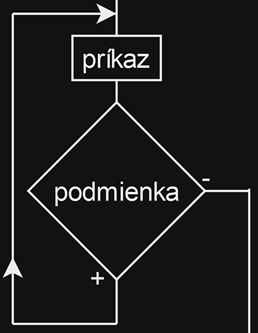

# Zadanie

Pojem cyklus, typy cyklov, vývojový diagram a zápis v C++ pre cyklus do while, príkazy break a continue.
Príklad: Napíšte pomocou cyklu do while nasledovný program: Zadajte z klávesnice kladné číslo. Slučka so zadaním čísla sa opakuje, pokiaľ nezadáte kladné číslo. Na záver vypíšte zadané kladné číslo.

# Vypracovanie

## Cyklus

Cyklus je štruktúra, ktorá opakuje zadaný kus kódu, pokiaľ je splnená nejaká podmienka. Každému opakovaniu cyklu sa hovorí iterácia.

V C++ poznáme 3 typy cyklov:

1. cyklus s podmienkou na začiatku - while
2. cyklus s podmienkou na konci - do while
3. cyklus s určeným počtom opakovaní – for

### Cyklus do while

- cyklus s neznámym počtom opakovaní (môže sa použiť aj pri známom počte opakovaní)
- príkaz sa musí vykonať aspoň raz
- premenné použité v podmienke cyklu do while nesmú byť deklarované vo vnútri cyklu

```cpp
  do
    príkaz;
  while (podmienka); // musí byť ;
```

- Cyklus s podmienkou na konci testuje podmienku vykonávania vždy po vykonaní tela cyklu a riadi sa týmito pravidlami:
  - Vykoná sa príkaz. Ak je podmienka pravdivá (true), vykoná sa príkaz znovu.
  - Ak je podmienka nepravdivá (false), cyklus sa ukončí.
  - Ak je podmienka nepravdivá po prvom vykonaní tela cyklu, príkaz sa vykonal práve raz.



### Break – predčasné ukončenie cyklu

- Príkaz break slúži k predčasnému ukončeniu cyklu. Vykonaním tohto príkazu je cyklus v danom mieste okamžite ukončený.

### Continue - vynechanie jedného kroku cyklu

- Príkaz continue (pokračuj) slúži pre predčasné ukončenie jedného kroku (iterácie) cyklu. Príkazy vložené do tela cyklu za príkaz continue sa už nevykonajú, cyklus ale nekončí a vracia sa na test podmienky vykonávania tela cyklu.
- Príkaz continue sa používa v tele cyklu väčšinou v spojení s podmienkou.

# Príklad

Napíšte pomocou cyklu do while nasledovný program: Zadajte z klávesnice kladné číslo. Slučka so zadaním čísla sa opakuje, pokiaľ nezadáte kladné číslo. Na záver vypíšte zadané kladné číslo.

```cpp
#include <iostream>
using namespace std;

int main() {
	int cislo;

	do {
		cout << "Zadajte kladne cislo: ";
		cin >> cislo;
	} while (cislo <= 0);

	cout << "Zadane kladne cislo je: " << cislo << endl;

	return 0;
}
```
