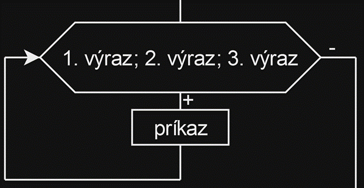

# Zadanie

Pojem cyklus, jednotlivé typy cyklov, vývojový diagram a zápis v C++ pre cyklus for, príkazy break a continue.
Príklad: Napíšte pomocou cyklu for nasledovný program: Vypíšte na obrazovku čísla od -10 do 10.

# Vypracovanie

## Cyklus

Cyklus je štruktúra, ktorá opakuje zadaný kus kódu, pokiaľ je splnená nejaká podmienka. Každému opakovaniu cyklu sa hovorí iterácia.

V C++ poznáme 3 typy cyklov:

1. cyklus s podmienkou na začiatku - while
2. cyklus s podmienkou na konci - do while
3. cyklus s určeným počtom opakovaní – for

### Cyklus for

- cyklus so známym počtom opakovaní

```cpp
for ( 1. výraz; 2.výraz; 3.výraz )
 	príkaz;
```

- 1.výraz - inicializácia riadiacej premennej – cyklus ju urobí iba raz, a to pred prvým vykonaním tela cyklu
- 2.výraz - podmienka – vyhodnocuje sa pred každým vykonaním tela cyklu. Ak je true telo cyklu sa vykoná, inak sa cyklus ukončí.
- 3.výraz - zmena riadiacej premennej – vyhodnocuje sa po vykonaní tela cyklu. Slúži na počítanie iterácií cyklu.



### Break – predčasné ukončenie cyklu

- Príkaz break slúži k predčasnému ukončeniu cyklu. Vykonaním tohto príkazu je cyklus v danom mieste okamžite ukončený.

### Continue - vynechanie jedného kroku cyklu

- Príkaz continue (pokračuj) slúži pre predčasné ukončenie jedného kroku (iterácie) cyklu. Príkazy vložené do tela cyklu za príkaz continue sa už nevykonajú, cyklus ale nekončí a vracia sa na test podmienky vykonávania tela cyklu.
- Príkaz continue sa používa v tele cyklu väčšinou v spojení s podmienkou.

# Príklad

Napíšte pomocou cyklu for nasledovný program: Vypíšte na obrazovku čísla od -10 do 10.

```cpp
#include <iostream>
using namespace std;

int main() {
    for (int i = -10; i <= 10; i++) {
        cout << i << endl;
    }
    
    return 0;
}
```
