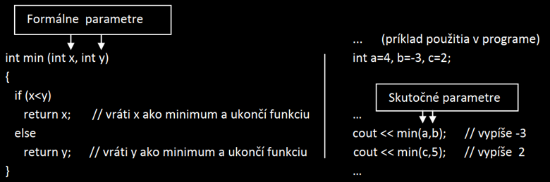

# Zadanie

Pojem funkcia, výhody používania funkcií, na funkcii main charakterizujte jednotlivé časti funkcie, pojmy prototyp funkcie (dopredná deklarácia funkcie) a dátový typ void, princíp predávania parametrov funkcie hodnotou a adresou (odkazom).

# Vypracovanie

## Funkcia

- skupina príkazov, ktoré spoločne plnia zadanú úlohu.
- Rozdelenie kódu do samostatných funkcií sprehľadní program. Ak má funkcia na starosti konkrétnu úlohu, ktorú je v programe potrebné vykonať niekoľkokrát, príslušný kód stačí napísať raz, a potom už iba voláte funkciu.
- Výhody používania funkcií:
  - Umožňujú rozdeliť program do kratších celkov
  - Opakujúce časti nie je potrebné viackrát opisovať
  - Prípadnú zmenu kódu opravíme iba na jednom mieste
  - Správnu činnosť možno overiť nezávisle na zvyšku programu
  - Vyššia zrozumiteľnosť programu - návrh programu metódou zhora dole

### Definovanie a volanie funkcií

#### Definícia funkcie – pozostáva z hlavičky funkcie a tela funkcie.

```cpp
typNavratovejHodnoty identifikator(parametre) {  // Hlavička funkcie
  …
  …                                // Telo funkcie
  return navratovaHodnota;
}
```

**Hlavička funkcie** definuje 3 vlastnosti:

- Typ návratovej hodnoty
- Identifikátor funkcie ( meno funkcie )
- Parametre (vstupno/výstupné operandy) – každý parameter musí byť definovaný samostatne

**Telo** funkcie obsahuje operácie, ktoré má funkcia vykonať. Zvyčajne posledným príkazom je _return_ (návrat), ktorý ukončí vykonávanú funkciu a predá jej výsledok.

**Návratová hodnota** - Funkcie môžu vracať hodnoty ľubovoľného typu okrem typu pole.

### Typ void

- Existujú funkcie, ktoré nemajú žiadnu návratovú hodnotu. Vtedy typ návratovej hodnoty je void (prázdny). Tento typ sa nemôže použiť na deklaráciu premennej, nebude jej pridelená žiadna pamäť.
- Používa sa len pre funkcie.
- Ak je návratová hodnota typu void, príkaz return nepredáva výsledok, ale iba ukončuje funkciu. Ak netreba funkciu predčasne ukončiť, nemusíme príkaz return vôbec použiť.

### Poradie vykonávania príkazov

- Program vždy začína prvým príkazom funkcie main
- Ak sa v maine nachádza volanie funkcie, jej príkazy sa spustia práve v tom bode behu programu

### Prototypy funkcií (dopredná deklarácia funkcií)

- Prototyp uvádzame nad definíciou funkcií. Prototyp má podobnú úlohu ako hlavička funkcie, ale končí bodkočiarkou, pretože je to príkaz.

```cpp
void pozdrav(); //prototyp

int main() {
  pozdrav();

  return 0;
}

void pozdrav() { //funkcia
  cout << “Hello!\n“;
}
```

## Predávanie parametrov

- Parametre sú informácie, ktoré funkcia dostáva, aby mohla vykonať zadanú úlohu.

### Predávanie parametrov hodnotou

- Je vhodné vtedy, keď vo volanej funkcii nepotrebujete meniť hodnoty parametrov, t.j nepotrebujeme meniť hodnoty skutočných parametrov.
- Pre funkcie, ktoré majú parametre volané hodnotou platia tieto pravidlá:
  - hodnota skutočného parametra sa do formálneho parametra skopíruje,
  - zmena formálneho parametra nemá vplyv na skutočný parameter (neplatí to pri parametroch typu pole),
  - ako skutočný parameter môže byť použitá premenná alebo literál.



### Predávanie parametrov odkazom

- Je vhodné vtedy, keď vo volanej funkcii potrebujete meniť hodnoty parametrov. Prejaví sa to na zmene hodnoty aj skutočného parametra. Niekedy je potrebné, aby funkcia predané parametre zmenila.

#### Deklarácia premennej typu odkaz (referencia)

- Odkaz je špeciálny typ ukazovateľa.
- Pre deklaráciu premennej typu odkaz používame symbol &. Premenná typu odkaz musí byť inicializovaná už pri deklarácii.

```cpp
int i, &r=i;       // deklarácia premennej i a inicializácia odkazu r na premennú i
```
-	Raz nastavený odkaz  sa už nesmie neskôr meniť, t.j. ak je odkaz napojený na nejakú premennú, nemôže sa neskôr nastaviť na inú premennú. Toto je rozdiel oproti ukazovateľom. 
-	Na čo vlastne slúžia odkazy ? Odkazy sa používajú výhradne v parametroch funkcií. Tu je automaticky zaručená inicializácia (pri predaní parametrov sa skutočný parameter napojí na formálny parameter typu odkaz).
