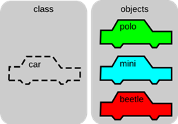

# Zadanie

Historický vývoj programovacích jazykov, princíp OOP, pojmy trieda a objekt, príklad ich deklarácie, tri základné vlastnosti OOP.

# Vypracovanie

Vývoj programovacích jazykov vždy reagoval na potrebu spracovania úloh určitého charakteru. V čase, kedy úlohy zaznamenali nárast objemu spracovávaných údajov, nárast zložitosti úloh a opakovateľnosť rôznych častí úloh, zaznamenávame v programovacích jazykoch vznik makier, podprogramov a funkcií.

Vývojom ľudskej spoločnosti dochádza k potrebe riešiť stále zložitejšie úlohy so stále väčším objemom údajov. Riešenie týchto čoraz zložitejších úloh je opäť v ich dekompozícii, t.j. rozdelení na menšie celky. Teraz však už nepostačuje len zavedenie nových funkcií. Všímame si, že úlohy popisujú určité objekty (konkrétne subjekty) z nášho reálneho života (osoby, veci, predmety, ...), a preto sa javí ako rozumné, rozdeliť zložité úlohy na menšie celky, ktoré zodpovedajú daným konkrétnym objektom. Tieto menšie celky zodpovedajúce objektom riešiť samostatne. Z tohto dôvodu vznikla potreba zaviezť tzv. **objekt** a nový dátový typ pomocou ktorého takýto objekt vytvoríme. Takto vznikol nový dátový typ **trieda**.

Pri tvorbe objektov sa ukázalo za rozumné spojiť v objekte jeho vlastnosti (dáta) a jeho funkcie. Navyše sa týmto spojením podarilo vyriešiť aj otázku ochrany dát objektu, ktorá je riešená pomocou jeho funkcií.

Práve zavedením objektov sa jazyk C rozšíril na verziu C++, ktorú nazývame **objektovo orientovaným jazykom**.

## Objekt

Objekt je základnou jednotkou OOP. Zlučuje dáta, aj funkcie pracujúce s týmito dátami do jedného celku. Objekt zodpovedá konkrétnemu subjektu. Je vytvorený pomocou dátového typu trieda.


## Trieda

Trieda je dátový typ. Je to teda šablóna (plán) objektu, ktorá popisuje z čoho bude objekt pozostávať a aké operácie môžeme s daným objektom vykonávať. Trieda nie je spájaná so žiadnym konkrétnym subjektom, je to abstrakt.



### Deklarácia triedy

Všeobecne vyzerá deklarácia triedy nasledovne:

```cpp
class MenoTriedy {
  // private funkcie a premenne
  public:
  // public funkcie a premenne
};

// definicie clenskych funkcii - metod
```

Triedy združujú dáta a funkcionalitu – obsahujú aj premenné, a aj metódy pre manipuláciu s nimi. **Deklaráciou triedy vytvárame obdobu nového dátového typu**.

```cpp
class JednoduchaTrieda {
  public:  // nasledujuce premenne a funkcie budu verejne
  int clenskaPremenna; // clenska premenna typu int
  void clenskaFunkcia(); // clenska metoda bez navratoveho typu
};
// definicia clenskej funkcie pre JednoduchaTrieda
void JednoduchaTrieda::clenskaFunkcia() {
  cout << "clenskaPremenna = " << clenskaPremenna << endl;
}
```

## Vlastnosti OOP

Obecne všetky OOP jazyky, vrátanie C++ zdieľajú tri definované vlastnosti:

1. **zapuzdrenie (encapsulation)** - Objekt svoj stav uchováva vo svojich dátach, ktoré sú väčšinou vonkajšiemu okoliu skryté a s týmto okolím (zvyšnou časťou programu) komunikuje prostredníctvom svojich funkcií, o ktorých tiež nemusíme vedieť ako sú zapísané.

2. **polymorfizmus (polymorphism)** – schopnosť výskytu v mnohých formách. V rámci objektového programovania je to vlastnosť, ktorá umožňuje, aby bolo jedno meno použité pre viacej príbuzných (s podobným účelom) funkcií, ale líšiacich sa typom použitých dát.

3. **dedičnosť (inheritance)** - proces vytvárania odvodenej triedy

4. **abstrakcia (abstraction)** - slúži na zjednodušenie komplexnosti tým, že umožňuje vytvárať zjednodušené modely reálnych objektov a systémov

## Rozdiel medzi public a private

- Členské premenné a funkcie tried sú štandardne private. Všetky členské premenné a funkcie tried zadeklarované za kľúčovým slovom `public:` sú verejné.
- K verejnej členskej premennej alebo funkcii môže pristupovať ktokoľvek z vonku. Public vlastnosti a metódy sú teda rozhraním objektu (čiernej skrinky, ktorej implementáciu nemusíme poznať).
- Pre verejné členy platí, že sa na ne môžeme odkazovať z akéhokoľvek miesta pomocou operátora `.`. Pre súkromné členy nám to C++ nedovolí.
- K súkromným členským premenným alebo funkciám majú prístup iba členské funkcie triedy.
- Súkromné členské premenné však môžeme sprístupňovať pomocou verejných členských funkcií.
- Bežne tieto metódy označujeme ako „get metódy“ a „set metódy“. Ich výhodou je možnosť lepšej kontroly nad čítaním a najmä zápisom nových hodnôt do nášho objektu.

Triedy môžeme inicializovať pomocou funkcie konštruktora, ktorá sa vloží do deklarácie triedy
