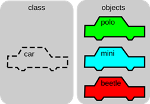
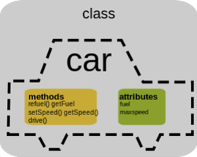

# Zadanie

Pojmy trieda a objekt.
Príklad: Zadeklarujte triedu KRUH s premennou polomer. Na tomto príklade vysvetlite možnosti prístupu (prístupové úrovne) k premennej polomer, pojmy konštruktor, parametrický konštruktor a deštruktor a aplikujte ich na triede KRUH.

# Vypracovanie

## Trieda

Trieda je dátový typ. Je to teda šablóna (plán) objektu, ktorá popisuje z čoho bude objekt pozostávať a aké operácie môžeme s daným objektom vykonávať. Trieda nie je spájaná so žiadnym konkrétnym subjektom, je to abstrakt.



### Deklarácia triedy

Všeobecne vyzerá deklarácia triedy nasledovne:

```cpp
class menoTriedy {
  // private funkcie a premenne
  public:
  // public funkcie a premenne
};

// definicie clenskych funkcii - metod
```

Triedy združujú dáta a funkcionalitu – obsahujú aj premenné, a aj metódy pre manipuláciu s nimi. **Deklaráciou triedy vytvárame obdobu nového dátového typu**.

```cpp
class JednoduchaTrieda {
  public:  // nasledujuce premenne a funkcie budu verejne
  int clenskaPremenna; // clenska premenna typu int
  void clenskaFunkcia(); // clenska metoda bez navratoveho typu
};
// definicia clenskej funkcie pre JednoduchaTrieda
void JednoduchaTrieda::clenskaFunkcia() {
  cout << "clenskaPremenna = " << clenskaPremenna << endl;
}
```

## Objekt

Objekt je základnou jednotkou OOP. Zlučuje dáta, aj funkcie pracujúce s týmito dátami do jedného celku. Objekt zodpovedá konkrétnemu subjektu. Je vytvorený pomocou dátového typu trieda.



## Rozdiel medzi public a private

- Členské premenné a funkcie tried sú štandardne private. Všetky členské premenné a funkcie tried zadeklarované za kľúčovým slovom `public:` sú verejné.
- K verejnej členskej premennej alebo funkcii môže pristupovať ktokoľvek z vonku. Public vlastnosti a metódy sú teda rozhraním objektu (čiernej skrinky, ktorej implementáciu nemusíme poznať).
- Pre verejné členy platí, že sa na ne môžeme odkazovať z akéhokoľvek miesta pomocou operátora `.`. Pre súkromné členy nám to C++ nedovolí.
- K súkromným členským premenným alebo funkciám majú prístup iba členské funkcie triedy.
- Súkromné členské premenné však môžeme sprístupňovať pomocou verejných členských funkcií.
- Bežne tieto metódy označujeme ako „get metódy“ a „set metódy“. Ich výhodou je možnosť lepšej kontroly nad čítaním a najmä zápisom nových hodnôt do nášho objektu.

## Konštruktor triedy

- Všetky objekty, ktoré vytvoríme, vyžadujú určitý druh inicializácie. K ošetreniu tejto situácie poskytuje C++ funkciu konštruktor, ktorá môže byť vložená do deklarácie triedy. Konštruktor triedy je volaný vždy, keď je vytváraný objekt danej triedy. Všetky inicializácie, ktoré je nutné na objekte previesť, môže automaticky vykonať konštruktor.
- Konštruktor má rovnaké meno ako trieda, ktorej je časťou, a nemá návratový typ. Pre globálne objekty je konštruktor objektu volaný iba raz, keď sa program začína prvýkrát spúšťať. Pre lokálne objekty je konštruktor volaný vždy, keď je prevádzaný deklaračný príkaz.

**Bezparametrický konštruktor**

```cpp
class TriedaSKonstruktorom {
  int premenna;
  public:
    TriedaSKonstruktorom(); // deklaracia konstruktora
    void Print();
};
// konstruktor triedy TriedaSKonstruktorom
TriedaSKonstruktorom::TriedaSKonstruktorom() {
  premenna = 10; // inicializacia hodnoty v konstruktore
}
```

**Parametrický konštruktor** - (konštruktor má v tomto prípade parametre, ktoré sú zadané počas volania triedy v maine).

```cpp
Point(int x_param, int y_param); // v definicii triedy

...

Point::Point(int x_param, int y_param) { // telo noveho parametrickeho konstruktora
  x = x_param;
  y = y_param;
}
```

# Príklad

Zadeklarujte triedu KRUH s premennou polomer. Na tomto príklade vysvetlite možnosti prístupu (prístupové úrovne) k premennej polomer, pojmy konštruktor, parametrický konštruktor a deštruktor a aplikujte ich na triede KRUH.

```cpp
#include <iostream>
#include <cmath>
using namespace std;

class Kruh {
    private:
        double polomer;
    public:
        Kruh() {
            polomer = 0;
        }
        Kruh(double r) {
            polomer = r;
        }
        ~Kruh() {
            cout << "Kruh s polomerom " << polomer << " bol zmazany." << endl;
        }
        double getPolomer() {
            return polomer;
        }
        void setPolomer(double r) {
            polomer = r;
        }
        double getObvod() {
            return 2 * M_PI * polomer;
        }
        double getObsah() {
            return M_PI * polomer * polomer;
        }
};
```