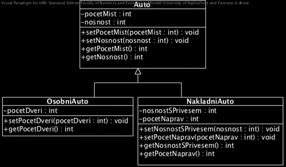

# Zadanie

Princípy dedičnosti medzi triedami, možnosti zmeny úrovne prístupu pri dedení.
Príklad: Napíšte príklad dedičnosti medzi triedami Otec (s premennými meno a bydlisko) a Syn (s premennými meno, bydlisko a zamestnanie). Trieda Syn je potomkom triedy Otec.

# Vypracovanie

## Trieda

Trieda je dátový typ. Je to teda šablóna (plán) objektu, ktorá popisuje z čoho bude objekt pozostávať a aké operácie môžeme s daným objektom vykonávať. Trieda nie je spájaná so žiadnym konkrétnym subjektom, je to abstrakt.


- Dedičnosť je proces vytvárania odvodenej triedy (derived class) z nejakej už existujúcej triedy (base class). Odvodená trieda zdedí vlastnosti a metódy rodičovskej triedy, a pridá k nim svoje vlastné.
- Pomocou dedičnosti je možné zabezpečiť, aby niekoľko odvodených tried malo isté spoločné vlastnosti alebo metódy, a spĺňali tak rovnaké rozhranie. V jazyku C++ sa používa tzv. viacnásobná dedičnosť, ktorá znamená, že jedna trieda môže dediť z viacerých tried.



```cpp
class Kruznica {
  public:
    int r;
    kruznica(int pR);
    double obvod();
};

Kruznica::Kruznica(int pR) {
  r = pR;
}

double Kruznica::obvod() {
  return 2 * M_PI * r;
}

class Kruh : public Kruznica {
  public:
    Kruh(int pR);
    double obsah();
};

Kruh::Kruh(int pR) : Kruznica(pR) {
}

double Kruh::obsah() {
  return M_PI * r * r;
}
```

Príklad tried s dedičnosťou. Trieda Kruh je odvodená od triedy Kruznica. Preberá od nej premennú r a funkciu obvod(), a definuje vlastnú funkciu obsah().

# Príklad

Napíšte príklad dedičnosti medzi triedami Otec (s premennými meno a bydlisko) a Syn (s premennými meno, bydlisko a zamestnanie). Trieda Syn je potomkom triedy Otec.

```cpp
#include <iostream>
#include <string>
using namespace std;

class Otec {
    protected:
        string meno;
        string bydlisko;
    public:
        Otec(string pMeno, string pBydlisko) {
            meno = pMeno;
            bydlisko = pBydlisko;
        }
};

class Syn : public Otec {
    private:
        string zamestnanie;
    public:
        Syn(string pMeno, string pBydlisko, string pZamestnanie) : Otec(pMeno, pBydlisko) {
            zamestnanie = pZamestnanie;
        }
};

int main() {
    Syn syn("Janko", "Bratislava", "Programátor");
    return 0;
}
```