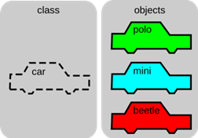

# Zadanie

Pojem polymorfizmus v OOP, možnosti riešenia polymorfizmu.
Príklad: Napíšte príklad polymorfizmu funkcie obvod pre objekt štvorec a funkcie obvod pre objekt obdlžnik. Funkcie vypočítajú obvod štvorca a obdĺžnika.

# Vypracovanie

## Trieda

Trieda je dátový typ. Je to teda šablóna (plán) objektu, ktorá popisuje z čoho bude objekt pozostávať a aké operácie môžeme s daným objektom vykonávať. Trieda nie je spájaná so žiadnym konkrétnym subjektom, je to abstrakt.



## Objekt

Objekt je základnou jednotkou OOP. Zlučuje dáta, aj funkcie pracujúce s týmito dátami do jedného celku. Objekt zodpovedá konkrétnemu subjektu. Je vytvorený pomocou dátového typu trieda.


## Polymorfizmus

Polymorfizmus je definovaný ako výskyt odlišností v rámci jedného druhu. V rámci objektového programovania je to vlastnosť, ktorá umožňuje, aby bolo jedno meno použité pre viacej príbuzných (s podobným účelom) funkcií, ale líšiacich sa typom použitých dát, alebo počtom premenných.

Napríklad, ak máme dve funkcie s rovnakým názvom a počtom parametrov, ale ich parametre majú rozdielne dátové typy. Kompilátor v tomto prípade sám rozhodne o tom, ktorá metóda sa skutočne zavolá podľa toho, akého dátového typu budú parametre predané funkcii.

```cpp
int pridaj(int x, int y) {
  return x + y;
}

string pridaj(string a, string b) {
  return concatenate(a, b);
}
```

Ak volaná funkcia bude `pridaj( 5, 12 )`, použije sa funkcia `pridaj(int x, int y)`, v prípade volanej funkcie `pridaj( Jano, Konečný )`, použije sa `funkcia pridaj(string a, string b)`.

# Príklad

Napíšte príklad polymorfizmu funkcie obvod pre objekt štvorec a funkcie obvod pre objekt obdlžnik. Funkcie vypočítajú obvod štvorca a obdĺžnika.

```cpp
#include <iostream>
using namespace std;

class Stvorec {
    private:
        double a;
    public:
        Stvorec(double pA) {
            a = pA;
        }
        double obvod() {
            return 4 * a;
        }
};

class Obdlznik {
    private:
        double a, b;
    public:
        Obdlznik(double pA, double pB) {
            a = pA;
            b = pB;
        }
        double obvod() {
            return 2 * (a + b);
        }
};

int main() {
    Stvorec s(5);
    Obdlznik o(5, 10);

    cout << "Obvod stvorca: " << s.obvod() << endl;
    cout << "Obvod obdlznika: " << o.obvod() << endl;

    return 0;
}
```
