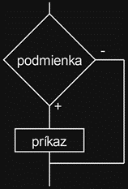
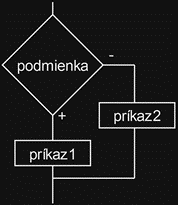

# Zadanie

Pojem relačný operátor a na čo slúži, jednotlivé relačné operátory a ich priorita, vetvenia if a if/else, ich vývojové diagramy a zápisy v jazyku C++,
príklad: Napíšte program: Zadajte z klávesnice celé číslo a vypíšte, či je kladné alebo záporné.

# Vypracovanie

## Relačné operátory

- Slúžia k porovnaniu 2 hodnôt. Výsledkom porovnania je buď true, alebo false.

| Operátor | Význam                |
| -------- | --------------------- |
| >        | Väčší ako             |
| <        | Menší ako             |
| >=       | Väčší alebo rovný ako |
| <=       | Menší alebo rovný ako |
| ==       | Rovný                 |
| !=       | Nerovný               |

## Vetvenie

Vetvenie je základný prostriedok, ktorý umožňuje riadiť beh programu. Podľa hodnoty premenných prebieha výpočet rôznymi cestami – vetvami.

### Vetvenie if (ak)

```cpp
if (podmienka)
  prikaz;
```

- Podmienka je booleovský výraz. Ak je podmienka splnená (má hodnotu true) vykoná sa príkaz. V opačnom prípade program pokračuje ďalej, príkaz nebude vykonaný.
- Štruktúra“ if ”zabezpečuje vo vetve realizáciu iba jeného príkazu. Niekedy však potrebujeme, aby sa vo vetve vykonalo viacero príkazov. Toto zabezpečíme tzv. blokom (zloženým príkazom) = {}



### Vetvenie if / else (ak/potom)

```cpp
if (podmienka)
  prikaz1;
else
  prikaz2;
```

- Podmienka je booleovský výraz. Ak je podmienka splnená (má hodnotu true) vykoná sa príkaz1. V opačnom prípade sa vykoná príkaz2.



#### Ternárny operátor (podmienkový operátor)

- Hlavná podmienka predchádzajúceho programu by sa dala napísať aj pomocou ternárneho operátora.
- _(podmienka)? prikaz1 : prikaz2;_

