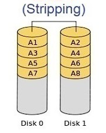
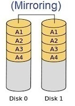
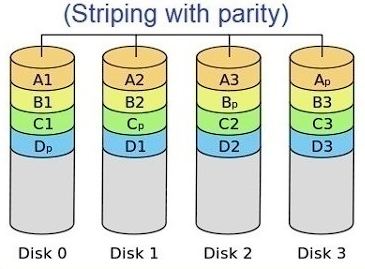
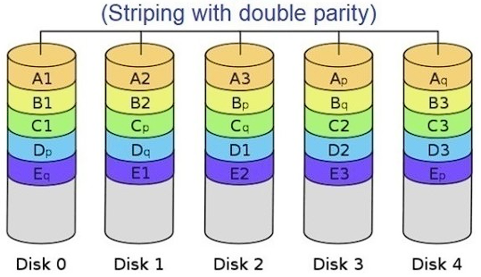
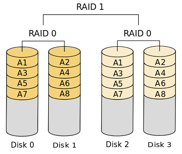

# Zadanie

1. **základné požiadavky na prevádzku serverov**
2. **špeciálne varianty hardwaru pre servery**
3. pojmy **hot plug, hot swap**
4. popíšte **typy RAID a UPS**

# **Sieťové a serverové technológie**

## **Základné požiadavky na prevádzku servera**

- **Hardware**: Kvalitný hardvér je kľúčový. To zahŕňa procesor(y), pamäť (RAM), úložisko (HDD alebo SSD), sieťové rozhrania a prípadne ďalšie špecializované zariadenia.
- **Operačný systém**: Serverové operačné systémy ako Linux, Windows Server a iné sú navrhnuté pre efektívnu a spoľahlivú prevádzku serverových aplikácií.
- **Sieťové pripojenie**: Stabilné a rýchle pripojenie k sieti je nevyhnutnosťou pre serverové aplikácie, či už ide o lokalnú sieť alebo internet.
- **Bezpečnosť**: Dôkladné zabezpečenie servera proti neoprávnenému prístupu a útokom je nevyhnutné.

## **Špeciálne hardvérové varianty pre servery**:

- **Rack Mount Server**: navrhnuté na inštaláciu do štandardných rackov v dátových centrách.
- **Blade Server**: optimalizované pre vysokú hustotu v dátových centrách a zdieľanie niektorých komponentov, ako sú napájacie zdroje a chladiče.
- **Tower Server**: vhodné pre menšie prevádzky alebo kancelárske prostredie, kde nie je k dispozícii špeciálny rack.

## **Koncepty Hot Plug a Hot Swap**:

- **Hot Plug**: je možné pripojiť alebo odpojiť zariadenie (ako pevný disk, pamäťový modul alebo ďalší komponent) z bežiaceho systému bez jeho vypnutia.
- **Hot Swap**: výmena zariadenia (napríklad výmenu chybného pevného disku) za behu bez prerušenia prevádzky.

## **Popis RAID a typy UPS**:

### RAID **(Redundant Array of Independent Disks)**

- Je to technológia, ktorá umožňuje kombinovať viac pevných diskov do jednej logického celku za účelom zvýšenia rýchlosti, odolnosti voči chybám alebo oboch. Existuje niekoľko typov RAID, ako sú RAID 0, RAID 1, RAID 5, RAID 1+0, RAID 0+1 ktoré poskytujú rôzne úrovne výkonu a ochrany údajov.

**RAID 0**

**RAID 1**

**RAID 5**

**RAID 6**

**RAID 0+1**

**RAID 1+0**

### UPS **(Uninterruptible Power Supply)**

- poskytujú záložnú energiu v prípade výpadku elektrickej energie. Existujú rôzne typy UPS, vrátane Online UPS, Standby UPS a Line-interactive UPS, ktoré sa líšia v tom, ako rýchlo a spoľahlivo reagujú na výpadok elektrickej energie a akú úroveň ochrany poskytujú.

1. **Standby (Offline) UPS:**
    - **Funkcia:** Poskytuje základnú ochranu a prepne sa na batériu v prípade výpadku napájania.
    - **Bežné použitie:** Osobné počítače, malé kancelárie/domáce kancelárie.
    - **Výhody:** Nákladovo efektívny, jednoduchý dizajn.
    - **Nevýhody:** Dlhý čas prepnutia (zvyčajne 5-20 milisekúnd) môže byť nevhodný pre citlivé zariadenia.
      
2. **Line-Interactive UPS:**
    - **Funkcia:** Poskytuje regulované a záložné napájanie, s možnosťou korekcie menších výkyvov napätia (podpätie a prepätie) bez prepnutia na batériu.
    - **Bežné použitie:** Malé a stredné podniky, sieťové zariadenia.
    - **Výhody:** Lepšia regulácia napätia, vyššia efektivita a mierne vyššie náklady ako záložný UPS.
    - **Nevýhody:** Stále má krátky čas prepnutia, ale všeobecne zlepšený v porovnaní so záložným UPS.
      
3. **Online (Double-Conversion) UPS:**
    - **Funkcia:** Poskytuje nepretržité napájanie z batérie, aj keď je hlavné napájanie prítomné, tým, že neustále konvertuje prichádzajúce AC napájanie na DC a späť na AC.
    - **Bežné použitie:** Dátové centrá, kritické systémy a citlivé zariadenia.
    - **Výhody:** Nulový čas prepnutia, poskytuje najvyššiu úroveň ochrany napájania.
    - **Nevýhody:** Vyššie náklady, vyššia spotreba energie a väčšia tvorba tepla.
      
4. **Ferroresonant UPS (Ferrorezonančné UPS):**
    - **Funkcia:** Využíva **ferrorezonančný transformátor** na poskytovanie regulovaného a záložného napájania s možnosťou zvládnuť významné výkyvy napájania.
    - **Bežné použitie:** Priemyselné aplikácie, prostredia s nekvalitným napájaním.
    - **Výhody:** Robustný, môže zvládnuť vážne výkyvy napájania.
    - **Nevýhody:** Veľký, menej efektívny a môže generovať značné množstvo tepla.
      
5. **Delta Conversion Online UPS:**
    - **Funkcia:** Podobný **Online UPS**, ale efektívnejší, konvertuje len časť prichádzajúceho napájania na DC a späť na AC, čím znižuje straty energie.
    - **Bežné použitie:** Veľké dátové centrá a kritická infraštruktúra s vysokými požiadavkami na efektivitu.
    - **Výhody:** Vysoká efektivita, nepretržitá ochrana napájania.
    - **Nevýhody:** Vysoké náklady, komplexný dizajn.
      
6. **Hybrid (Double Conversion on Demand) UPS:**
    - **Funkcia:** Prevádzkuje sa primárne v režime vysokej efektivity podobnom **Line-Interactive** UPS a prepne sa do režimu **Online UPS** len vtedy, keď to vyžadujú podmienky napájania.
    - **Bežné použitie:** Situácie, kde je dôležitá energetická efektivita, ale je tiež potrebná vysoká ochrana, keď je to potrebné.
    - **Výhody:** Vyvažuje efektivitu a ochranu, môže ponúknuť značné úspory energie.
    - **Nevýhody:** Nemusí poskytovať nepretržitú ochranu dvojitou konverziou, potenciálne vyššie počiatočné náklady. 
