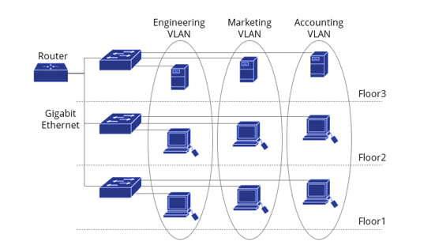

# Zadanie
pojem VLAN, princíp fungovania, výhody a nevýhody použitia siete s VLAN, účel jednotlivých typov VLAN sietí (management, natíve, data, VLAN1, voice), pojem trunk, popíšte činnosť protokolu VTP (server, client, transparent)

## Pojdem VLAN
VLAN (Virtual Local Area Network) siete predstavujú dôležitý koncept v oblasti počítačových sietí. Umožňujú logické rozdelenie zariadení na rovnakej fyzickej sieti do samostatných segmentov. Táto izolácia zvyšuje bezpečnosť a znižuje množstvo broadcastovej premávky, čo vedie k efektívnejšiemu využitiu sieťových zdrojov. VLAN siete sú flexibilné a môžu byť konfigurované podľa potrieb, čo umožňuje lepšiu správu a kontrolu nad sieťou.

## Využitie
VLAN je koncept v počítačových sieťach, ktorý umožňuje rozdelenie jednej fyzickej siete na viacero logických sietí. Tieto logické siete sú izolované jedna od druhej, čo znamená, že zariadenia v jednej VLAN nemôžu komunikovať s zariadeniami v inej VLAN bez smerovača alebo prepínača. 

## Výhody
- **Bezpečnosť** - VLAN môže byť veľmi užitočná v situáciách, kde je potrebné oddeliť typy prevádzky, napríklad v kancelárskej budove môžeme vytvoriť samostatnú VLAN pre rôzne tímy. Vďaka tomuto rozdeleniu budú citlivé dáta v jednej sieti oddelené od zvyšku siete. 
- **Rýchlosť** - VLAN môžu pomôcť znížiť preťaženie siete obmedzením počtu zariadení, ktoré môžu navzájom komunikovať. To môže viesť k rýchlejšej a spoľahlivejšej sieti.
- **Jednoduchšie spravovanie** - VLAN umožňuje ľahko pridať, presunúť alebo zmeniť sieťové zariadenia bez potreby fyzických zmien v káblovom infraštruktúre.

## Nevýhody
- **Komplexita** - Konfigurácia VLAN je zložitá. Malá chyba v konfigurácii VLAN môže spôsobiť, že všetky pripojené zariadenia budú nedostupné pre ostatné zariadenia. Ak má vaša sieť viacero prepínačov, musíme nakonfigurovať siete VLAN na všetkých prepínačoch.

## Typy VLAN
### Dátová VLAN
Dátová VLAN je VLAN, ktorá prenáša dátovú prevádzku používateľov. Dátové VLAN sú známe aj ako užívateľské VLAN. Všetky porty prepínača, ktoré sú členmi dátovej VLAN, majú priradené rovnaké VLAN ID.
### Hlasová (Voice) VLAN
Hlasová VLAN je špeciálny typ dátovej VLAN, ktorá je nakonfigurovaná na prenos hlasovej prevádzky v reálnom čase. Hlasová VLAN uprednostňujú hlasovú prevádzku pred inými typmi prenosu.
### Riadiaca (Management) VLAN
Riadiaca VLAN je špeciálna VLAN, ktorá sa používa na správu prepínačov na diaľku pomocou protokolov ako sú napríklad Telnet a SSH.
### Natívna VLAN
Natívna VLAN je špeciálna VLAN, ktorá sa používa na prenos neoznačených rámcov (untagged frames). Tieto rámce sú prenášané bez značky (tag), čo umožňuje ich spracovanie staršími zariadeniami, ktoré nepodporujú VLAN.

## Trunk
Trunk je komunikačná linka alebo spojenie medzi dvoma sieťovými zariadeniami určené na prenášanie viacerých signálov súčasne cez jedno spojenie.
### VLAN Trunking Protokol
VLAN Trunking Protokol (VTP) je protokol vyvinutý spoločnosťou Cisco, ktorý sa používa na správu konfigurácií VLAN v sieti. Pracuje na druhej vrstve a umožňuje centralizovanú správu VLAN, čo uľahčuje vykonávanie zmien, ktoré sa automaticky aplikujú na všetky prepínače v doméne. 
Funguje v troch režimoch server, transparent a client.
- **Server**
V režime servera môže prepínač vytvárať a modifikovať konfiguráciu VLAN. Prepínače VTP server automaticky šíria informácie o VLAN na všetky ostatné prepínače.
- **Client**
Klient, nemôže modifikovať, vytvárať a mazať VLAN. Úlohou klienta je spracovať VLAN zmeny a poslať VTP správy na všetky trunkové porty
- **Transparent**
VTP nie je povolené na transparentnom prepínači. Presúvajú VTP oznámenia, ale ignorujú informácie obsiahnuté v správach

