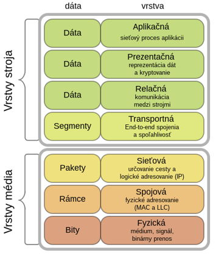
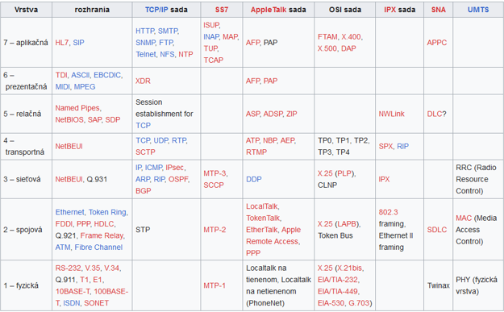
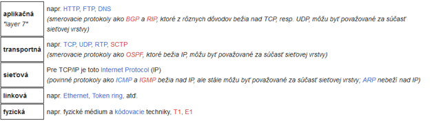
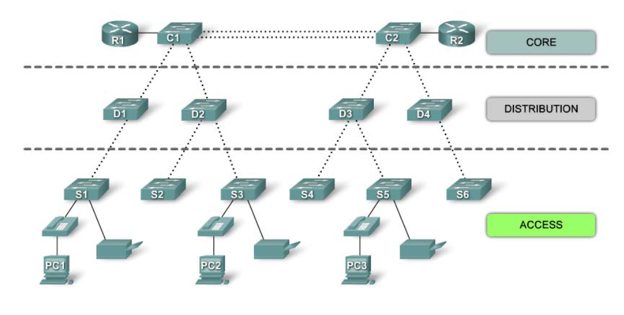

# Zadanie
vrstvy komunikačného modelu ISO OSI a TCIP modelu, prenosové dátové jednotky používané na jednotlivých vrstvách ISO OSI modelu a príklady adresovania, vrstvy hierarchického modelu siete s prepínačmi, požiadavky na prepínače na jednotlivých vrstvách

## ISO/OSI model
Jedná sa o abstraktný, na vrstvách založený opis návrhu štruktúry komunikačných a počítačových sieťových protokolov, vyvinutý ako súčasť iniciatívy Open Systems Interconnect. 

### Funkcia
Model funkčne rozdeľuje sieťové protokoly do siedmich vrstiev. Každá vrstva má vlastnosť, že používa funkcie vrstvy pod ňou a poskytuje funkcionalitu vrstve nadradenej. Systém implementujúci protokol pozostávajúcich z týchto vrstiev sa nazýva protocol stack. Tento model sa zhruba drží výpočtového a sieťového priemyslu. Jeho hlavnou funkciou je spojenie vrstiev, ktoré určuje, akým spôsobom spolupracuje jedna vrstva s druhou. To znamená, že vrstva implementovaná jedným výrobcom spolupracuje s inou vrstvou od druhého výrobcu.

### Vrstvy
**Fyzická vrstva**
Do fyzickej vrstvy patria fyzikálne a elektrické špecifikácie zariadení. Patrí sem rozloženie pinov, špecifikácia napätí, a typov kábla. Na fyzickej vrstve pracujú **huby a repeater**. Funkcie a služby poskytované touto vrstvou sú:
•	nadviazanie a ukončenie spojenia komunikačným médiom
•	účasť na procese efektívneho zdieľania komunikačných zdrojov medzi viacerých používateľov. Napríklad riešenie konfliktov a kontrola toku dát.
•	modulácia, alebo konverzia medzi reprezentáciou digitálnych údajov v používateľskom koncovom zariadení a zodpovedajúcimi signálmi prenášanými komunikačným kanálom. Toto sú signály prenášané fyzickou kabelážou, napr. optickým vláknom alebo medeným drôtom. Na tejto vrstve pracuje SCSI.

**Linková vrstva**
Linková vrstva poskytuje funkcionalitu a prostriedky na prenos dát medzi sieťovými entitami a prípadné opravenie chýb, ktoré sa vyskytnú na fyzickej vrstve. Adresná schéma je fyzická, čo znamená, že adresy sú pevne zadané v sieťových kartách v čase výroby (**MAC adresy**). Najznámejším príkladom je Ethernet. Iné príklady spojových protokolov sú HDLC a ADCCP pre point-to-point alebo systém s prepínaním paketov a LLC. Na tejto vrstve pracujú **switche a bridge**.

**Sieťová vrstva**
Sieťová vrstva poskytuje funkčné a procedurálne prostriedky prenášania dátových sekvencií s premenlivou dĺžkou od zdroja k cieľu jednou alebo viacerými sieťami. Sieťová vrstva sa stará o smerovanie (routing), kontrolu toku dát, segmentáciu/desegmentáciu a kontrolu chýb. Na tejto vrstve pracuje **router**. Posiela údaje sieťami a umožňuje fungovanie internetu, hoci existujú switche pracujúce na 3. vrstve (IP) switche. Adresná schéma je hierarchická.

**Transportná vrstva**
Účelom transportnej vrstvy je poskytovať transparentný prenos dát medzi koncovými používateľmi. Transportná vrstva má na starosti spoľahlivosť daného spojenia. Znamená to, že transportná vrstva dokáže sledovať a znova posielať pakety, ktoré neboli správne doručené. Najznámejším príkladom protokolu 4. vrstvy je **TCP a UDP**.

**Relačná vrstva**
Relačná vrstva poskytuje mechanizmus správy dialógu medzi aplikačnými procesmi koncového používateľa. Poskytuje buď **duplexnú alebo poloduplexnú komunikáciu**. Táto vrstva nadväzuje a ukončuje TCP/IP relácie (sessions).

**Prezentačná vrstva**
Prezentačná vrstva odbremeňuje aplikačnú vrstvu od starostí s rozdielnou syntaktickou reprezentáciou dát v rámci systému koncového používateľa. MIME kódovanie, kryptovanie a podobná manipulácia a reprezentácia dát sa odohráva na tejto vrstve. Príkladom prezentačnej služby je konverzia súboru s EBCDIC kódovaním na kódovanie ASCII.

*Aplikačná vrstva*
Táto vrstva implementuje rozhranie pre aplikačné procesy a poskytuje im služby. Bežné aplikačné služby poskytujú sémantickú konverziu medzi príbuznými aplikačnými procesmi. Príkladmi spoločných aplikačných služieb sú virtuálny súbor, virtuálny terminál (napr. telnet) a „Job Transfer and Manipulation protocol“ (JTM, ISO/IEC 8832).

## TCP/IP Model
Jedná sa o súbor komunikačných protokolov implementujúcich tzv. protocol stack, na ktorých je postavený systém Internet. Nazýva sa súbor TCP/IP protokolov podľa dvoch najdôležitejších protokolov, ktoré obsahuje: Transmission Control Protocol (TCP) a Internet Protocol (IP), ktoré boli zároveň aj prvé definované. 

### Vrstvy

**Fyzická vrstva**
Fyzická vrstva charakterizuje komunikáciu po fyzickej stránke—konvencie o používanom médiu (drôty, optické vlákno, rádiové spojenie) a všetky súvisiace podrobnosti ako konektory, kódy kanálov a modulácia, sila signálu, vlnová dĺžka, nízkoúrovňová synchronizácia a časovanie, maximálne vzdialenosti. Balík internetových protokolov nepokrýva fyzickú vrstvu žiadnej siete.

**Linková vrstva**
Linková vrstva alebo spojová vrstva špecifikuje spôsob prenosu paketov fyzickou vrstvou, vrátane rámcovania (t. j. špeciálne bitové vzory označujúce začiatok a koniec paketu). Napríklad Ethernet má polia v hlavičke paketu, ktoré špecifikujú pre ktorý stroj alebo stroje v sieti sú pakety určené. Príkladom protokolov linkovej vrstvy sú Ethernet, Wireless Ethernet, SLIP, Token Ring a ATM.

**Sieťová vrstva**
Rieši problém transportu paketov v rámci jednej siete a transport dát z jednej siete do druhej. Sem vo všeobecnosti patrí smerovanie paketu sieťou sietí, známou ako internet. O úlohy prenosu paketov zo zdroja do cieľa sa stará IP. IP je schopný niesť dáta množstva rozličných vysokoúrovňových protokolov; tieto protokoly sú definované jedinečným číslom IP Protocol Number.

**Transportná vrstva**
Protokoly transportnej vrstvy riešia problémy ako spoľahlivosť („dorazili dáta do cieľa?“) a zabezpečujú, že dáta prídu v správnom poradí. V balíku protokolov TCP/IP tiež určujú, na akú aplikáciu sú dáta určené.

**Aplikačná vrstva**
Aplikačná vrstva je vrstva bežne používaná väčšinou programov pracujúcich so sieťou na komunikáciu prostredníctvom siete. Procesy na tejto vrstve závisia na konkrétnej aplikácii; dáta prenášané programom v jeho internom formáte sú kódované do štandardného protokolu. Niektoré programy bežiace na tejto vrstve poskytujú služby, ktoré priamo podporujú používateľské aplikácie, sem patria programy a ich špecifické protokoly ako HTTP (World Wide Web), FTP (prenos súborov), SMTP (e-mail), SSH (zabezpečené vzdialené prihlasovanie), DNS (vyhľadávania hostname/IP adresy) a mnohé iné.

## Hierarchický model siete
Kľúčom k dobrému návrhu siete je jej hierarchický dizajn siete.

**Hierarchická sieť:**
- Ohraničuje veľkosť a rozsah kolíznych, broadcastových a chybových domén
- Zjednodušuje činnosť rôznych mechanizmov, ktoré pracujú v jednotlivých oblastiach sietí
- Dovoľuje efektívne prideľovať IP adresy a ľahko ich sumarizovať v smerovacích protokoloch
- Sprehľadňuje toky dát
- Jasne oddeľuje funkčné bloky pre L2 a L3

Rozdelenie siete do blokov (vrstiev) s definovanými funkciami: Core, Distribution, Access

**Funkcie Prístupovej (ACCESS) vrstvy:**
- Poskytuje prostriedky (Prepínače, huby, prístupové body (AP)) na pripájanie zariadení používateľov (PC, telefóny, tlačiarne a pod.) do siete
- Riadi kto môže komunikovať cez sieť

**Funkcie Distribučnej (DISTRIBUTION) vrstvy**
- Agreguje dáta z prístupovej vrstvy
- Definuje subsiete a smerovanie medzi nimi
- Riadi tok dát
- Smerovacie a ACL politiky
- Definuje Broadcast L2 domény
- Musí byť vysokorýchlostná aredundantná

**Funkcie Core vrstvy:**
- Tvorí vysokorýchlostnú chrbticu siete
- Musí zvládať spracovávať veľké objemy dát a veľmi rýchlo
- Agreguje dáta od distribučných prepínačov
- Musí byť vysokodostupná a redundantná
- Pripája „sieť“ k Internetu a jeho zdrojom

**Vlastnosti prepínačov pre Access layer**
- **Port security**
	- Rozhoduje kto sa môže pripojiť
- **VLANs**
	- Virtualizácia LAN
- **Rýchlosť (Speed**)
	- Fast Ethernet (100Mbps) or Gigabit.
- **Power over Ethernet (PoE)**
	- Drahé ale efektívne a efektné 
- **Link aggregation**
	- Pre uplinky
- **Quality of service (QoS)**
	- Pre multimédia ak je problém s oneskorením kapacitou

**Vlastnosti prepínačov pre Distribution Layer**
- **Podpora MultiLayer**
	- Aspoň L2/L3 – smerovanie medzi VLANs
- **Vysoká prepínacia rýchlosť**
	- processing
- **Rýchlosť portov Gbps or 10Gbps ports**
- **Redundancia**
- **Bezpečnosť**
	- Access control lists (ACL)
- **Agregácia Liniek**
- **Quality of service**
- **Dostupnosť**
	- Zálohovanie napájacích zdrojov (Hot swappable)

**Vlastnosti prepínačov pre Core Layer**
- **Podpora Multilayer for Network layer (3) - routing**
- **Vysoká prepínacia aj procesná rýchlosť**
- **Vysoká rýchlosť portov**
	- 1Gbps, 10Gbps
- **Redundancia**
- **Agregácia Liniek**
- **Quality of service**
- **Dostupnosť**
	- Zálohovanie napájacích zdrojov (Hot swappable)?
- **Treba sa vyhnúť akýmkoľvek spomaľovacím činnostiam.**

