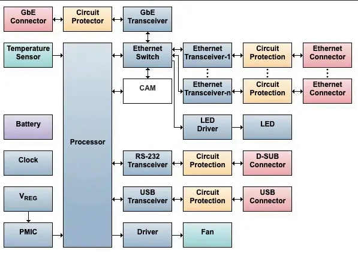

# Zadanie
hardwarová bloková schéma prepínača, funkcia prepínača v generickej sieti, uveďte vrstvu modelu OSI a typ adries s ktorými pracujú, postup naplnenia tabuľky MAC adries v prepínači

## Hardwarová bloková schéma prepínača

## funkcia prepínača v generickej sieti
Prepínač je základným zariadením v sieťovej infraštruktúre, ktoré zabezpečuje efektívne a bezpečné preposielanie dát medzi pripojenými zariadeniami. Vďaka schopnosti segmentovať sieť, podporovať VLAN, poskytovať vysokú priepustnosť a rôzne bezpečnostné funkcie, prepínač zvyšuje celkový výkon a bezpečnosť siete.

- Preposielanie dátových paketov:
    - Prepínač prijíma dátové pakety od pripojených zariadení a preposiela ich iba na určený port, kde je cieľové zariadenie. Tým sa znižuje zbytočná sieťová prevádzka v porovnaní s - hubmi, ktoré odosielajú pakety na všetky porty.

- Vytváranie a správa MAC tabuľky:
    - Prepínač ukladá MAC adresy pripojených zariadení a ich priradenie k jednotlivým portom do tabuľky známej ako MAC tabuľka alebo CAM tabuľka. Na základe tejto tabuľky dokáže - efektívne smerovať pakety.

- Segmetácia siete:
    - Prepínač umožňuje rozdelenie siete do viacerých segmentov, čím znižuje kolízne domény a zvyšuje efektivitu siete. Každý port prepínača predstavuje samostatnú kolíznu doménu.

- Podpora VLAN (Virtual Local Area Network):
    - Prepínač umožňuje vytváranie virtuálnych lokálnych sietí, čo poskytuje logické rozdelenie siete na menšie časti, zvyšuje bezpečnosť a lepšie riadenie siete.

- Full-duplex komunikácia:
    - Prepínač podporuje full-duplex režim, čo znamená, že dáta môžu byť odosielané a prijímané súčasne, čím sa zvyšuje celková priepustnosť siete.

- QoS (Quality of Service):
    - Niektoré prepínače podporujú QoS, čo umožňuje priorizáciu určitých typov sieťovej prevádzky (napr. hlasu alebo videa), aby bola zabezpečená požadovaná kvalita služby.

- Bezpečnostné funkcie:
    - Moderné prepínače môžu obsahovať rôzne bezpečnostné funkcie, ako sú port security (obmedzenie prístupu na porty na základe MAC adries), ochrana proti ARP spoofingu, a iné.

- Správa a monitorovanie:
    - Spravovateľné prepínače umožňujú vzdialenú správu a monitorovanie siete prostredníctvom protokolov ako SNMP (Simple Network Management Protocol) alebo webového rozhrania.

## Vrstva a typ adries
pracuje na druhej vrstve ISO/OSi modelu, MAC a LLC adresy

## Postup naplnenia tabuľky MAC adries:

- Inicializácia prepínača:
    - Keď sa prepínač zapne, jeho MAC tabuľka je prázdna.

- Prijatie rámca:
    - Prepínač prijme rámec (frame) na jednom zo svojich portov. Každý rámec obsahuje zdrojovú MAC adresu (source MAC address) a cieľovú MAC adresu (destination MAC address).

- Kontrola zdrojovej MAC adresy:
    - Prepínač skontroluje zdrojovú MAC adresu rámca.
    - Ak táto adresa nie je v MAC tabuľke, prepínač ju pridá spolu s portom, na ktorom rámec prijal.
    - Ak zdrojová MAC adresa už je v tabuľke, prepínač aktualizuje informáciu o porte, ak sa táto adresa presunula na iný port.

- Kontrola cieľovej MAC adresy:
    - Prepínač potom skontroluje cieľovú MAC adresu rámca.
    - Ak cieľová MAC adresa je v MAC tabuľke, prepínač vie, na ktorý port má rámec preposlať.
    - Ak cieľová MAC adresa nie je v tabuľke, prepínač prepošle rámec na všetky ostatné porty okrem toho, z ktorého rámec prišiel (tento proces sa nazýva flooding).

- Časový limit (Aging):
    - Každá záznam v MAC tabuľke má časový limit, počas ktorého je považovaný za platný. Ak prepínač počas tohto času neprijme žiadne rámce z danej MAC adresy, záznam sa odstráni z - - tabuľky. Tým sa zabezpečuje, že tabuľka obsahuje len aktuálne a platné záznamy.

