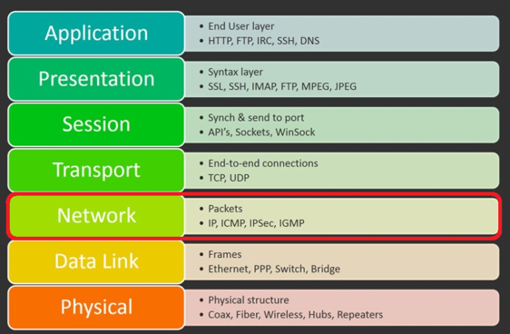

# Zadanie
hardwarová bloková schéma smerovača, funkcia smerovača v generickej sieti, uveďte vrstvu modelu OSI a typ adries s ktorými pracujú, tabuľky ACL a ARP v prepínači, NAT vysvetlite čo je, na čo slúži a ako pracuje (NAT, NAT64)

## hardwarová bloková schéma smerovača

1.	CPU (Central Processing Unit) 
2.	RAM (Random Access Memory)
3.	EEPROM (Electrically Erasable Programmable Read-Only Memory) – V ROM je uložený firmware, boostrap ...
4.	NVRAM– Tu sa ukladá systémová konfigurácia, ACL tabuľky ...
5.	PSU (Power Supply Unit) – napájanie pre router
6.	Base Clock – Slúži ako koordinátor medzi jednotlivými komponentami routera.
7.	RTC (Real Time Clock) – Hodiny reálneho času 
8.	UART - konzolový port
9.	HOST – USB-A port 
10.	Retimer – vyhladzuje, opravuje a pripravuje signál, na väčšiu vzdialenosť
11.	SFP+ - modul/adaptér pre optický kábel
12.	PHY – v podstate dátovo-analógový prevodník, prekladá údaje z 3. vrstvy OSI modelu na 1. vrstvu
13.	RJ-45

## funkcia smerovača v generickej sieti
Router (smerovač) je zariadenie, ktoré spája 2 alebo viacero segmentov sietí alebo podsietí. Router spĺňa 2 úlohy: menežuje prevádzku medzi spojenými sieťami pomocou smerovania packetov cielením IP adresám a dovoľuje viacerým zariadeniam používať rovnaké internetové pripojenie.

### **DHCP server**
Väčšina routerov obsahuje integrovaný DHCP server, ktorý je možné aktivovať, aby automaticky pridelil a spravoval IP adresy pre zariadenia pripájajúce sa do siete. Týmto sa zjednodušuje proces pripájania nových zariadení a zabezpečuje efektívna alokácia IP adries v sieti.
### **Ochrana firewallom**
Väčšina routerov je vybavená zabudovanými firewallmi, ktoré slúžia ako robustná ochrana proti malvéru a ďalším hrozbám. Tieto firewally zabezpečujú sieť a pripojené zariadenia pred neoprávneným prístupom a zlomyseľnými aktivitami.
### **VPN služby**
Niektoré routery majú schopnosť podporovať pripojenia virtuálnej súkromnej siete (VPN). Aktiváciou VPN služieb na routery môžu používatelia získať prístup k bezpečným, súkromným pripojeniam bez potreby inštalovať VPN aplikácie na individuálne zariadenia. Tým sa zvyšuje súkromie a bezpečnosť pre prenosy dát v sieti.

## ACL (Access Control List)
ACL je sada pravidiel alebo podmienok, ktoré určujú, aká prevádzka je povolená, aby prešla cez sieťové zariadenie, ako je napríklad router alebo firewall, a ktorá prevádzka je blokovaná. ACL sa často používajú na zlepšenie bezpečnosti siete kontrolou prístupu k sieťovým zdrojom na základe kritérií, ako sú IP adresy, protokoly, čísla portov a ďalšie faktory.
Kľúčové body týkajúce sa ACL:
1. Typy ACL 
    - ACL môžu byť kategorizované do dvoch hlavných typov: 
        1. Štandardné ACL: Tieto ACL filtrujú prevádzku len na základe zdrojovej IP adresy. Sú jednoduché na konfiguráciu, ale ponúkajú obmedzenú kontrolu nad filtrovaním prevádzky.
        2. Rozšírené ACL: Tieto ACL poskytujú detailnejšiu kontrolu umožňovaním filtrovania na základe zdrojových a cieľových IP adries, protokolov, čísel portov a ďalších parametrov.
2. Smerovanie ACL: 
    - ACL môžu byť aplikované v dvoch smeroch: 
        1. Prichádzajúce ACL: Aplikované na prichádzajúcu prevádzku na rozhraní.
        2. Odchádzajúce ACL: Aplikované na odchádzajúcu prevádzku na rozhraní.
3. Poradie položiek ACL: 
    - Položky ACL sú spracovávané postupne, pričom prvá zhodujúca sa položka má prednosť. Je dôležité zvážiť poradie položiek ACL, aby sa zabezpečilo, že prevádzka je filtrovaná správne.
4. Implicitné zamietnutie: 
    - Predvolene, ak prevádzka nezodpovedá žiadnej položke ACL, je implicitne zamietnutá. To znamená, že ACL explicitne definujú, aká prevádzka je povolená, a všetko ostatné je blokované.
5.	Aplikácie: 
    - ACL sa často používajú na rôzne účely, vrátane: 
        1.	Kontrola prístupu k sieťovým zdrojom na základe IP adries alebo podsietí.
        2.	Implementácia bezpečnostných politík na ochranu pred neoprávneným prístupom alebo útokmi.
        3.	Filtrovanie prevádzky na optimalizáciu výkonu siete a využitia šírky pásma.

## ARP (Address Resolution Protocol)
**ARP** je protokol používaný na mapovanie IP adries na MAC adresy v lokálnej sieti. Keď zariadenie potrebuje komunikovať s iným zariadením v tej istej sieti, používa ARP na určenie MAC adresy, ktorá zodpovedá cieľovej IP adrese.

- Rozpoznanie ARP: Keď zariadenie potrebuje odoslať údaje inému zariadeniu v tej istej sieti, skontroluje svoju ARP tabuľku, či už pozná MAC adresu, ktorá zodpovedá cieľovej IP adrese. Ak sa MAC adresa nenachádza v ARP tabuľke, zariadenie odošle na sieť vysielanie požiadavky ARP, požiadané zariadenie so zadanou IP adresou, aby odpovedalo so svojou MAC adresou.
- Položky ARP tabuľky: ARP tabuľky ukladajú mapovanie IP adries na MAC adresy pre zariadenia, ktoré nedávno komunikovali v sieti. Každá položka zvyčajne obsahuje IP adresu, MAC adresu a časovú pečiatku označujúcu, kedy bola položka naposledy aktualizovaná.
- ARP Cache: ARP tabuľky sú často označované ako ARP cache, pretože ukladajú dočasné mapovania, ktoré môžu v priebehu času vypršať. Položky v ARP tabuľke môžu byť pravidelne aktualizované alebo odstránené, aby sa odzrkadlila zmena topológie siete.
- ARP Spoofing: ARP tabuľky sú zraniteľné voči útokom ARP spoofing, kde záškodnícke zariadenia posiela falošné ARP správy na spojenie svojej MAC adresy s IP adresou iného zariadenia. To môže viesť k odchyteniu alebo presmerovaniu prevádzky.
- Vyprázdnenie ARP Cache: V niektorých prípadoch môže byť potrebné vyprázdniť ARP cache na odstránenie zastaraných položiek alebo vymazanie neplatných mapovaní. To je možné urobiť pomocou správcovských príkazov alebo reštartovaním zariadenia.

## NAT (Network Adress Translation)
NAT je technika používaná v počítačových sieťach na úpravu informácií o sieťovej adrese v hlavičke IP paketov počas ich prenosu cez router alebo firewall. Primárnym účelom NAT je šetriť IP adresy a umožniť viacerým zariadeniam v rámci súkromnej siete zdieľať jednu verejnú IP adresu pre komunikáciu s zariadeniami na internete.
NAT funguje udržiavaním tabuľky mapovania, ktorá linkuje IP adresy a čísla portov s príslušnými verejnými IP adresami a číslami portov. Keď zariadenie zo súkromnej siete zaháji komunikáciu so zariadením na internete, router NAT preloží súkromnú IP adresu a číslo portu na jeho verejný ekvivalent pred poslaním paketu na internet. Keď sa odpoveďový paket vráti, router obráti preklad a pošle ho na príslušné zariadenie v rámci súkromnej siete.
**NAT poskytuje niekoľko výhod, vrátane:**
1.	Šetrí IP adresy - NAT umožňuje organizáciám so súkromnými rozsahmi IP adries pripojiť sa k internetu s menším počtom verejných IP adries, čo pomáha šetriť obmedzený počet dostupných adries IPv4. 
2.	Zlepšená bezpečnosť: NAT funguje ako bariéra medzi súkromnou sieťou a internetom, skrýva vnútorné IP adresy a robí to ťažším pre zlomyseľné subjekty priamy útok na zariadenia v sieti. 
3.	Zjednodušené správa siete: NAT umožňuje používať súkromné rozsahy IP adries v rámci vnútorných sietí bez potreby koordinácie s externými entitami alebo poskytovateľmi internetových služieb (ISP).

### NAT64 
NAT64 je konkrétna varianta NAT navrhnutá na zjednodušenie komunikácie medzi zariadeniami s podporou iba IPv6 a zariadeniami s podporou iba IPv4. S úbytkom adries IPv4 a prechodom na IPv6 zohráva NAT64 kľúčovú úlohu pri umožňovaní komunikácie medzi sieťami, ktoré používajú rôzne verzie IP.
V sieťach s podporou iba IPv6 NAT64 prekladá IPv6 adresy a pakety na IPv4 adresy a naopak. To umožňuje zariadeniam s podporou IPv6 prístup k obsahu alebo službám hostovaným na serveroch s podporou iba IPv4 a naopak. NAT64 zvyčajne funguje spolu s mechanizmom známym ako DNS64, ktorý syntetizuje IPv6 adresy pre zdroje s podporou iba IPv4 tým, že im predchádza dobre známa predpona.
NAT64 pomáha premostiť medzeru medzi sieťami IPv4 a IPv6 počas prechodového obdobia, umožňujúc obom typom zariadení komunikovať navzájom bezproblémovo, zatiaľ čo sa prijíma IPv6 pokračuje v raste.

