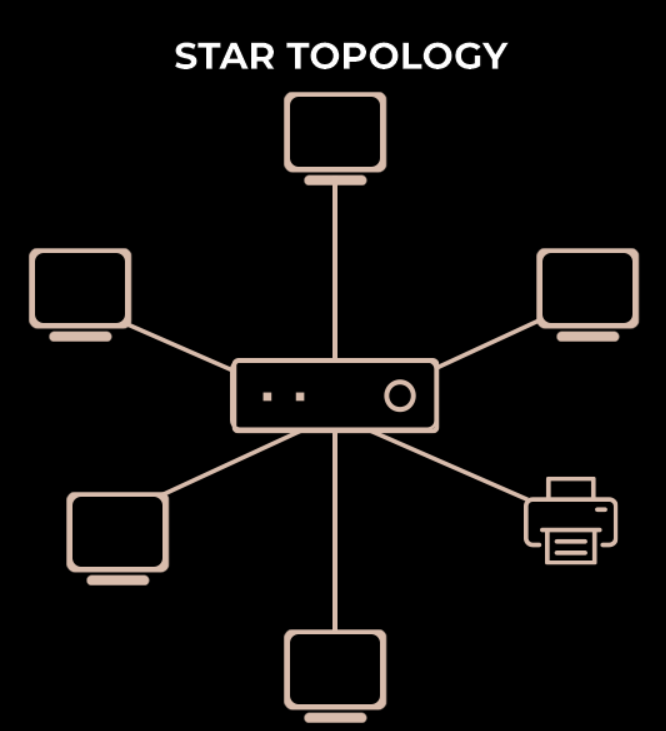

# Zadanie

- nakreslite a popíšte topológie siete, ich vplyv na náklady, rýchlosť a škálovateľnosť
- pojmy a účel zariadení NIC, repeater, hub, modem, switch, router, gateway, interface, transducer, corversion unit

# Vypracovanie

## Topológie siete

### Zbernicová topológia (Bus Topology)

- **Popis**: Všetky zariadenia sú pripojené na jednu centrálnu komunikačnú linku (bus).

- **Náklady**: Nízke náklady na kabeláž.
- **Rýchlosť**: Možné kolízie dát môžu znížiť rýchlosť.
- **Škálovateľnosť**: Obmedzená, pridaním ďalších zariadení sa zvyšuje riziko kolízií.

### Hviezdicová topológia (Star Topology)

- **Popis**: Všetky zariadenia sú pripojené k centrálnemu uzlu (switch alebo hub).

- **Náklady**: Stredné náklady na kabeláž, potrebný centrálny uzol.
- **Rýchlosť**: Vysoká, minimálne kolízie, centrálne riadenie dátových prenosov.
- **Škálovateľnosť**: Vysoká, jednoduché pridanie nových zariadení bez ovplyvnenia celej siete.

### Kruhová topológia (Ring Topology)

- **Popis**: Zariadenia sú zapojené v kruhu, kde každé zariadenie má pripojenie k dvom ďalším.

- **Náklady**: Stredné náklady na kabeláž.
- **Rýchlosť**: Rýchlosť môže byť dobrá, ale porucha jedného zariadenia môže ovplyvniť celú sieť.
- **Škálovateľnosť**: Pridanie zariadení môže byť zložitejšie, ale možné.

### Spletitá topológia (Mesh Topology)

- **Popis**: Každé zariadenie je pripojené k všetkým ostatným zariadeniam v sieti.

- **Náklady**: Vysoké náklady na kabeláž.
- **Rýchlosť**: Veľmi vysoká spoľahlivosť a rýchlosť, redundancia spojení.
- **Škálovateľnosť**: Vysoká, ale nákladná a zložitejšia implementácia.

### Stromová topológia (Tree Topology)

- **Popis**: Kombinácia hviezdicovej a zbernicovej topológie, kde jednotlivé hviezdy sú pripojené na centrálnu zbernicu.

- **Náklady**: Stredné až vysoké náklady na kabeláž a sieťové zariadenia.
- **Rýchlosť**: Vysoká v centrálnych častiach, môže klesať v okrajových častiach.
- **Škálovateľnosť**: Vysoká, jednoduché pridanie ďalších uzlov a zariadení.

## Zariadenia

**NIC (Network Interface Card)**

- **Definícia**: Hardvérová súčasť umožňujúca počítaču alebo zariadeniu pripojiť sa k sieti.
- **Účel**: Poskytuje fyzické a logické pripojenie k sieti.

**Repeater**

- **Definícia**: Zariadenie, ktoré zosilňuje a obnovuje signál v sieti, aby predĺžilo jeho dosah.
- **Účel**: Rozširuje dosah signálu, aby prekonal fyzické limity kabeláže.

**Hub**

- **Definícia**: Základné sieťové zariadenie, ktoré prijíma signál z jedného zariadenia a prenáša ho do všetkých ostatných zariadení v sieti.
- **Účel**: Spojenie viacerých zariadení v sieti, ale bez inteligentného riadenia dátového toku.

**Modem**

- **Definícia**: Zariadenie, ktoré prevádza digitálne signály na analógové a naopak, aby umožnilo komunikáciu cez telefónne linky alebo iné analógové prenosové médium.
- **Účel**: Poskytuje pripojenie k internetu cez analógové linky.

**Switch**

- **Definícia**: Inteligentné sieťové zariadenie, ktoré prijíma dátové pakety a smeruje ich iba na cieľové zariadenie.
- **Účel**: Efektívne riadenie dátového toku medzi zariadeniami v sieti, minimalizuje kolízie.

**Router**

- **Definícia**: Zariadenie, ktoré smeruje dátové pakety medzi rôznymi sieťami, často spája lokálnu sieť s internetom.
- **Účel**: Smerovanie dát medzi rôznymi sieťami a riadenie prístupu na internet.

**Gateway**

- **Definícia**: Zariadenie alebo softvérová brána, ktorá prekladá dáta medzi rôznymi sieťovými protokolmi.
- **Účel**: Umožňuje komunikáciu medzi sieťami používajúcimi rôzne protokoly.

**Interface**

- **Definícia**: Fyzické alebo logické rozhranie umožňujúce pripojenie a komunikáciu medzi zariadeniami alebo sieťami.
- **Účel**: Poskytuje spojenie a interakciu medzi rôznymi systémami.

**Transducer**

- **Definícia**: Zariadenie, ktoré prevádza jeden typ signálu alebo energie na iný, napríklad elektrický signál na svetlo.
- **Účel**: Umožňuje prevod signálov pre rôzne aplikácie, často v senzorových systémoch.

**Conversion Unit**

- **Definícia**: Zariadenie, ktoré prevádza signály alebo dáta medzi rôznymi formátmi alebo protokolmi.
- **Účel**: Zaisťuje kompatibilitu medzi rôznymi systémami a zariadeniami, napríklad konverzia medzi digitálnymi a analógovými signálmi.
